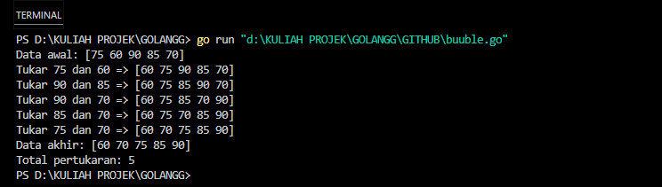
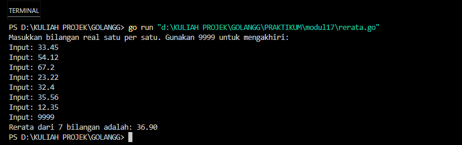
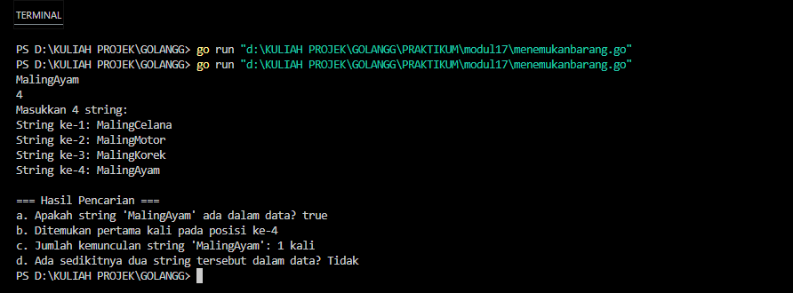
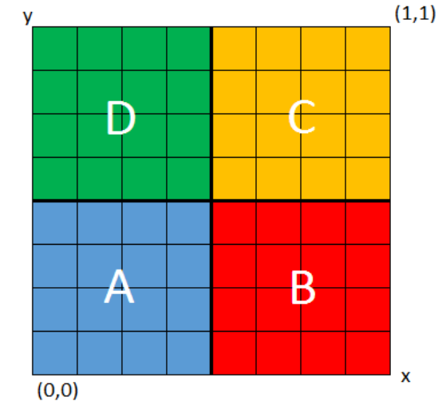
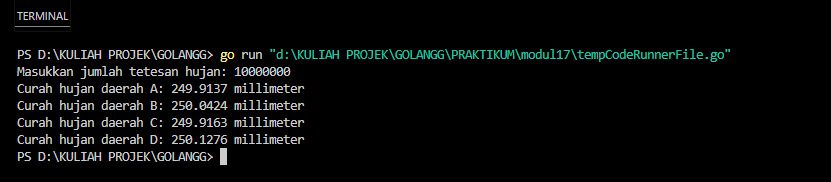
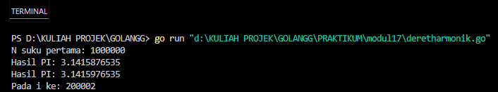
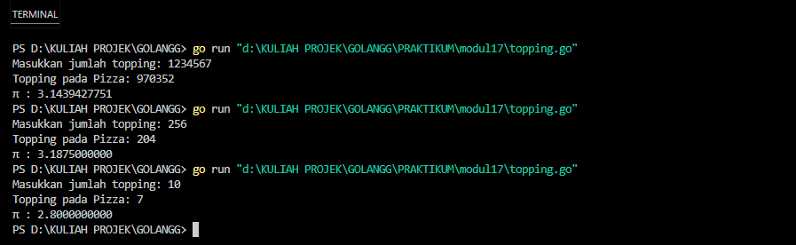

## Laporan Praktikum Modul 17 - Skema Pemrosesan Sekuensial


Nama : Rifa Cahya Ariby 
NIM : 103112400268

## Dasar Teori
Skema pemrosesan sekuensial adalah metode di mana data diproses secara berurutan, satu per satu, mengikuti urutan dari data pertama hingga terakhir. Pendekatan ini memastikan bahwa setiap data diproses secara berurutan tanpa ada yang terlewat, seperti membaca daftar nama dari atas ke bawah secara sistematis. Metode ini sederhana dan efektif untuk tugas-tugas yang memerlukan urutan, seperti pencarian, pengolahan data secara berurutan, atau menampilkan informasi secara berurutan.

## Guided
### Soal 1

Aldi memiliki daftar nilai ulangan matematika temannya: 75, 60, 90, 85, dan 70. Ia ingin mengurutkan nilai tersebut dari yang terkecil ke yang terbesar menggunakan **metode Bubble Sort**. 
**Pertanyaan:**
1. Tunjukkan proses pengurutan nilai menggunakan Bubble Sort **hingga semua nilai terurut.**
2. Berapa kali pertukaran (swap) terjadi dalam proses ini?

``` go
package main
import "fmt"
func bubbleSortWithSteps(arr []int) int {
    n := len(arr)
    swaps := 0
    for i := 0; i < n-1; i++ {
        for j := 0; j < n-1-i; j++ {
            if arr[j] > arr[j+1] {
                arr[j], arr[j+1] = arr[j+1], arr[j]
                swaps++
                fmt.Printf("Tukar %d dan %d => %v\n", arr[j+1], arr[j], arr)
            }
        }
    }

    return swaps
}
func main() {
    nilai := []int{75, 60, 90, 85, 70}
    fmt.Println("Data awal:", nilai)
    swapCount := bubbleSortWithSteps(nilai)
    fmt.Println("Data akhir:", nilai)
    fmt.Println("Total pertukaran:", swapCount)

}
```

### Output



Program di atas adalah implementasi algoritma **bubble sort** dalam bahasa Go yang digunakan untuk mengurutkan sebuah array angka secara menaik. Setiap kali terjadi pertukaran elemen selama proses pengurutan, program mencetak langkah pertukaran tersebut beserta kondisi array saat itu. Selain mengurutkan data, program juga menghitung dan menampilkan total jumlah pertukaran yang terjadi setelah proses selesai.

## Unguided

### Soal 1
1) Diberikan sejumlah bilangan real yang diakhiri dengan marker 9999, cari rerata dari bilanganbilangan tersebut.
### Code
``` go
package main

import "fmt"
  
func main() {

    var input float64
    var sum float64 = 0
    var count int = 0

    fmt.Println("Masukkan bilangan real satu per satu. Gunakan 9999 untuk mengakhiri:")

    for {
        fmt.Print("Input: ")
        fmt.Scan(&input)

        if input == 9999 {
            break
        }

        sum += input
        count++
    }

    if count > 0 {
        rerata := sum / float64(count)
        fmt.Printf("Rerata dari %d bilangan adalah: %.2f\n", count, rerata)
    } else {
        fmt.Println("Tidak ada data untuk dihitung reratanya.")
    }
}
```

### Output

  
Program di atas adalah program sederhana dalam bahasa Go yang meminta pengguna memasukkan bilangan real satu per satu hingga memasukkan angka khusus `9999` sebagai tanda berhenti. Program kemudian menghitung jumlah dan banyaknya bilangan yang dimasukkan, lalu menampilkan rerata (nilai rata-rata) dari bilangan-bilangan tersebut. Jika tidak ada bilangan yang dimasukkan sebelum `9999`, program akan memberi tahu bahwa tidak ada data untuk dihitung.
### Soal 2
2) Diberikan string x dan n buah string. x adalah data pertama yang dibaca, n adalah data bilangan yang dibaca kedua, dan n data berikutnya adalah data string. Buat algoritma untuk menjawab pertanyaan berikut:
	a. Apakah string x ada dalam kumpulan n data string tersebut?
	b. Pada posisi ke berapa string x tersebut ditemukan?
	c. Ada berapakah string x dalam kumpulan n data string tersebut? 
	d. Adakah sedikitnya dua string x dalam n data string tersebut?
### Code
``` go
package main
import "fmt"
func main() {

    var targetString string
    var jumlahData int

    fmt.Scanln(&targetString)
    fmt.Scanln(&jumlahData)

    kumpulanString := make([]string, jumlahData)
    fmt.Println("Masukkan", jumlahData, "string:")

    for i := 0; i < jumlahData; i++ {
        fmt.Printf("String ke-%d: ", i+1)
        fmt.Scanln(&kumpulanString[i])
    }

    ditemukan := false
    posisiPertama := -1
    jumlahKemunculan := 0

    for i, kata := range kumpulanString {
        if kata == targetString {
            if !ditemukan {
                posisiPertama = i + 1
            }
            ditemukan = true
            jumlahKemunculan++
        }
    }
  
    fmt.Println("\n=== Hasil Pencarian ===")
    fmt.Printf("a. Apakah string '%s' ada dalam data? %v\n", targetString, ditemukan)

    if ditemukan {
        fmt.Printf("b. Ditemukan pertama kali pada posisi ke-%d\n", posisiPertama)
        fmt.Printf("c. Jumlah kemunculan string '%s': %d kali\n", targetString, jumlahKemunculan)

        if jumlahKemunculan >= 2 {
            fmt.Println("d. Ada sedikitnya dua string tersebut dalam data? Ya")
        } else {
            fmt.Println("d. Ada sedikitnya dua string tersebut dalam data? Tidak")
        }
    } else {
        fmt.Println("b. Tidak ditemukan, jadi tidak ada posisi.")
        fmt.Println("c. Jumlah kemunculan: 0 kali")
        fmt.Println("d. Tidak ada dua string tersebut karena tidak ditemukan.")
    }
}
```
### Output

Program di atas adalah program dalam bahasa Go yang menerima input sebuah string target dan sejumlah data string, kemudian mencari apakah string target tersebut ada dalam data yang dimasukkan. Program akan menampilkan apakah string target ditemukan, posisi pertama kemunculannya, jumlah kemunculan string tersebut, serta apakah string tersebut muncul sedikitnya dua kali dalam data. Jika string tidak ditemukan, program akan menginformasikan bahwa string tersebut tidak ada beserta detail terkait pencarian.

### Soal 3
3) Empat daerah A, B, C, dan D yang berdekatan ingin mengukur curah hujan. Keempat daerah tersebut digambarkan pada bidang berikut:

Misal curah hujan dihitung berdasarkan banyaknya tetesan air hujan. Setiap tetesan berukuran 0.0001 ml curah hujan. Tetesan air hujan turun secara acak dari titik (0,0) sampai (1,1). Jika diterima input yang menyatakan banyaknya tetesan air hujan. Tentukan curah hujan untuk keempat daerah tersebut. 
Buatlah program yang menerima input berupa banyaknya tetesan air hujan. Kemudian buat koordinat/titik (x, y) secara acak dengan menggunakan fungsi **rand.Float64()**. Hitung dan tampilkan banyaknya tetesan yang jatuh pada daerah A, B, C dan D. Konversikan satu tetesan berukuran 0.0001 milimeter.
**Catatan**: Lihat lampiran untuk informasi menggunakan paket math/rand untuk menggunakan **rand.Float64()** yang menghasilkan bilangan riil acak [0..1]. 
**Berikut contoh masukan dan keluarannya:**


| No  | Masukan  | Keuaran                                                                                                                                                                        |
| --- | -------- | ------------------------------------------------------------------------------------------------------------------------------------------------------------------------------ |
| 1   | 10000000 | Curah hujan daerah A: 250.0066 milimeter<br>Curah hujan daerah B: 249.8981 milimeter <br>Curah hujan daerah C: 249.9930 milimeter <br>Curah hujan daerah D: 250.1023 milimeter |

### Code
``` go
package main
import (
    "fmt"
    "math/rand"
    "time"
)

func main() {

    var jumlahTetesan int
    const volumePerTetes = 0.0001 // millimeter
  
    fmt.Print("Masukkan jumlah tetesan hujan: ")
    fmt.Scanln(&jumlahTetesan)

    rand.Seed(time.Now().UnixNano())
    var tetesanA, tetesanB, tetesanC, tetesanD int

    for i := 0; i < jumlahTetesan; i++ {
        x := rand.Float64()
        y := rand.Float64()

        if x < 0.5 && y < 0.5 {
            tetesanA++

        } else if x >= 0.5 && y < 0.5 {
            tetesanB++

        } else if x < 0.5 && y >= 0.5 {
            tetesanC++

        } else {
            tetesanD++
        }
    }

    curahHujanA := float64(tetesanA) * volumePerTetes
    curahHujanB := float64(tetesanB) * volumePerTetes
    curahHujanC := float64(tetesanC) * volumePerTetes
    curahHujanD := float64(tetesanD) * volumePerTetes

    fmt.Printf("Curah hujan daerah A: %.4f millimeter\n", curahHujanA)
    fmt.Printf("Curah hujan daerah B: %.4f millimeter\n", curahHujanB)
    fmt.Printf("Curah hujan daerah C: %.4f millimeter\n", curahHujanC)
    fmt.Printf("Curah hujan daerah D: %.4f millimeter\n", curahHujanD)

}
```

### Output


Program di atas adalah simulasi sederhana dalam bahasa Go untuk menghitung curah hujan di empat daerah berbeda (A, B, C, dan D) berdasarkan sejumlah tetesan hujan yang dimasukkan pengguna. Program menggunakan angka acak (random) untuk menentukan posisi tetesan hujan dalam koordinat 2D (x dan y antara 0 dan 1), lalu mengelompokkan tetesan tersebut ke daerah sesuai kuadran koordinat. Setiap tetesan dianggap memiliki volume tetap (0.0001 millimeter), sehingga setelah semua tetesan dihitung, program menghitung dan menampilkan total curah hujan (dalam millimeter) untuk masing-masing daerah berdasarkan jumlah tetesan yang jatuh di daerah tersebut.

### Soal 4
4) Berdasarkan formula Leibniz, nilai π dapat dinyatakan sebagai deret harmonik ganti sebagai berikut:

$$
1 - \frac{1}{3} + \frac{1}{5} - \frac{1}{7} + \frac{1}{9} - \cdots = \frac{\pi}{4}
$$
   
Suku ke-i dinyatakan sebagai 𝑆𝑖 dan jumlah deret adalah 𝑆. Apabila diketahui suku pertama 
𝑆1 = 1, suku kedua 𝑆2 = $−1 / 3$ . Temukan rumus untuk suku ke-𝒊 atau 𝑆𝑖 .
Berdasarkan rumus tersebut, buatlah program yang menghitung 𝑆 untuk 1000000 suku pertama.
Perhatikan contoh sesi interaksi program di bawah ini ( **teks bergaris bawah** adalah input/read):

N suku pertama: 1000000
Hasil PI: 3.1415951

Setelah jalan, modifikasi program tersebut agar menyimpan nilai dua suku yang bersebelahan, 𝑆𝑖 dan 𝑆𝑖+1. Buatlah agar program tersebut sekarang berhenti apabila selisih dari kedua suku tersebut tidak lebih dari 0.00001. 
Perhatikan contoh sesi interaksi program di bawah ini (teks bergaris bawah adalah input/read):

N suku pertama: 1000000 
Hasil PI: 3.1415876535
Hasil PI: 3.1415976535 
ada i ke: 200002

### Code
``` go
package main

import "fmt"

func absolut(x float64) float64 {

    if x < 0 {
        return -x
    }
    return x

}

func pembulatan(x float64) float64 {
    return float64(int64(x*1e10)) / 1e10

}

// Fungsi utama dengan pemrosesan sequential

func prosesSequential(sukuMaks int) (float64, float64, int) {
    var hasilPi, sukuSaatIni, beda, piLama, piBaru float64
    tanda := 1.0
    index := 0

    for index = 0; index < sukuMaks; index++ {
        sukuSaatIni = tanda / float64(2*index+1)    
        hasilPi += sukuSaatIni                      
        piBaru = hasilPi * 4                        
        if index > 0 {
            beda = absolut(piBaru - piLama)         
            if beda < 0.00001 {
                break
            }
        }
        piLama = piBaru
        tanda *= -1
    }
    return pembulatan(piLama), pembulatan(piBaru), index + 2
}

func main() {
    var n int
    fmt.Print("N suku pertama: ")
    fmt.Scan(&n)
    piAwal, piAkhir, posisi := prosesSequential(n)
    fmt.Printf("Hasil PI: %.10f\n", piAwal)
    fmt.Printf("Hasil PI: %.10f\n", piAkhir)
    fmt.Printf("Pada i ke: %d\n", posisi)

}
```


### Output

Program di atas adalah implementasi perhitungan nilai π (pi) menggunakan deret Leibniz dengan metode pemrosesan sekuensial dalam bahasa Go. Fungsi `prosesSequential` menjumlahkan suku-suku deret hingga mencapai batas maksimum suku (`sukuMaks`) atau sampai selisih perubahan nilai π antara dua iterasi berturut-turut kurang dari 0.00001, sebagai kondisi konvergensi. Fungsi ini mengembalikan dua nilai π yang dibulatkan hingga 10 desimal (nilai π pada iterasi sebelumnya dan iterasi saat ini) serta posisi iterasi saat kondisi berhenti terpenuhi. Program utama meminta input jumlah suku maksimum, menjalankan perhitungan, lalu menampilkan hasil π dan posisi iterasi terakhir secara rapi.

### Soal 5
5) Monti bekerja pada sebuah kedai pizza, saking ramainya kedai tersebut membuat Monti tidak ada waktu untuk bersantai. Suatu ketika saat sedang menaburkan topping pada pizza yang diletakkan pada wadah berbentuk persegi, terpikirkan oleh Monti cara menghitung berapa banyak topping yang dia butuhkan, dan cara menghitung nilai 𝝅. 
	Ilustrasi seperti gambar yang diberikan di bawah, topping adalah lingkaran-lingkaran kecil.
	Ada yang tepat berada di atas pizza, dan ada yang jatuh di dalam kotak tetapi berada di luar pizza.

	Apabila luas pizza yang memiliki radius r adalah 𝐿𝑢𝑎𝑠𝑃𝑖𝑧𝑧𝑎 = 𝜋𝑟 2 dan luas wadah pizza yang memiliki panjang sisi 𝑑 = 2𝑟 adalah 𝐿𝑢𝑎𝑠𝑊𝑎𝑑𝑎ℎ = 𝑑 2 = 4𝑟 2 , maka diperoleh perbandingan luas kedua bidang tersebut

	$𝐿𝑢𝑎𝑠𝑃𝑖𝑧𝑧𝑎 / 𝐿𝑢𝑎𝑠𝑊𝑎𝑑𝑎ℎ = 𝜋𝑟^2 / 4𝑟^2 = 𝜋^4$

	Persamaan lingkaran adalah $(𝑥 − 𝑥𝑐) 2 + (𝑦 − 𝑦𝑐)^2 = 𝑟^2$ dengan titik pusat lingkaran adalah (𝑥𝑐 , 𝑦𝑐). Suatu titik sembarang (𝑥, 𝑦) dikatakan berada di dalam lingkaran apabila memenuhi ketidaksamaan:

	$(𝑥 − 𝑥𝑐) 2 + (𝑦 − 𝑦𝑐)^2 ≤ 𝑟^2$

	Pada ilustrasi topping berbentuk bulat kecil merah dan biru pada gambar adalah titik-titik (𝑥, 𝑦) acak pada sebuah wadah yang berisi pizza. Dengan jumlah yang sangat banyak dan ditaburkan merata (secara acak), maka kita bisa mengetahui berapa banyak titik/topping yang berada tepat di dalam pizza menggunakan ketidaksamaan di atas. 
	Buatlah program yang menerima input berupa banyaknya topping yang akan ditaburkan, kemudian buat titik acak (𝑥, 𝑦) dari bilangan acak riil pada kisaran nilai 0 hingga 1 sebanyak topping yang diberikan. Hitung dan tampilkan berapa banyak topping yang jatuh tepat di atas pizza. 
	Titik pusat pizza adalah (0.5, 0.5) dan jari-jari pizza adalah 0.5 satuan wadah.
	Perhatikan contoh sesi interaksi program di bawah ini (teks bergaris bawah adalah input/read):

| Banyak Topping: **1234567** <br>Topping pada Pizza: 969000 | Banyak Topping: 10000000 <br>Topping pada Pizza: 7856565 |
| ---------------------------------------------------------- | -------------------------------------------------------- |

Apabila topping yang ditaburkan oleh Monti secara merata berjumlah yang sangat banyak, maka topping akan menutupi keseluruhan wadah pizza. Luas Pizza sebanding dengan topping yang berada pada pizza, sedangkan Luas Wadah sebanding dengan banyaknya topping yang ditaburkan. Dengan menggunakan rumus perbandingan luas yang diberikan di atas, maka nilai konstanta 𝜋 dapat dihitung. Modifikasi program di atas sehingga dapat menghitung dan menampilkan nilai konstanta π. Perhatikan contoh sesi interaksi program di bawah ini (teks bergaris bawah adalah input/read):

| Banyak Topping: 1234567 <br>Topping pada Pizza: 969206 <br>PI : 3.1402297324 | Banyak Topping: 10 <br>Topping pada Pizza: 5 <br>PI : 2.0000000000     |
| ---------------------------------------------------------------------------- | ---------------------------------------------------------------------- |
| Banyak Topping: 256 <br>Topping pada Pizza: 198 <br>PI : 3.0937500000        | Banyak Topping: 5000 <br>Topping pada Pizza: 3973<br>PI : 3.1784000000 |
### Code
```go
package main
import (
    "fmt"
    "math/rand"
    "time"
)

func main() {
    var jumlahTopping int
    fmt.Print("Masukkan jumlah topping: ")
    fmt.Scan(&jumlahTopping)

    const xPusat = 0.5
    const yPusat = 0.5
    const jariJari = 0.5

    rand.Seed(time.Now().UnixNano())
  
    jumlahDalamPizza := 0


    for i := 0; i < jumlahTopping; i++ {
        x := rand.Float64()
        y := rand.Float64()

        if (x-xPusat)*(x-xPusat)+(y-yPusat)*(y-yPusat) <= jariJari*jariJari {
            jumlahDalamPizza++
        }
    }
    estimasiPi := 4 * float64(jumlahDalamPizza) / float64(jumlahTopping)

    fmt.Println("Topping pada Pizza:", jumlahDalamPizza)
    fmt.Printf("π : %.10f\n", estimasiPi)

}
```
### Output

Program di atas adalah simulasi estimasi nilai π (pi) menggunakan metode Monte Carlo dalam bahasa Go. Program meminta pengguna memasukkan jumlah topping (titik acak) yang akan ditempatkan secara acak pada bidang persegi dengan koordinat antara 0 dan 1. Setiap topping dianggap sebagai titik dengan koordinat (x, y) acak. Program kemudian menghitung berapa banyak titik yang jatuh di dalam lingkaran dengan pusat di (0.5, 0.5) dan jari-jari 0.5 (lingkaran yang tepat berada di dalam persegi tersebut). Dengan membandingkan rasio titik dalam lingkaran terhadap total titik, program mengestimasi nilai π berdasarkan rumus luas lingkaran terhadap luas persegi, yaitu π ≈ 4 × (jumlah titik dalam lingkaran / total titik). Hasil estimasi π dan jumlah topping yang jatuh di dalam lingkaran ditampilkan sebagai output.