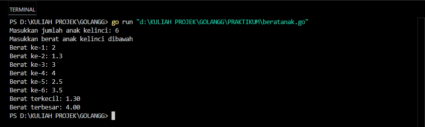
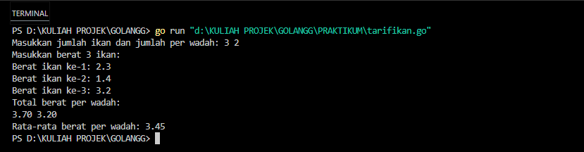
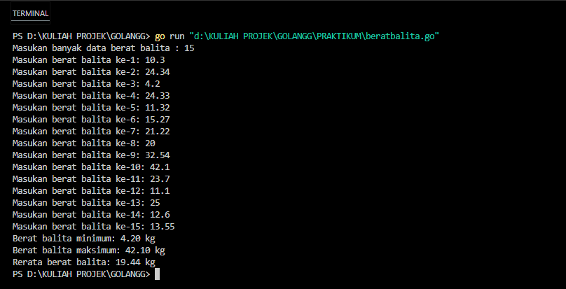

<h1 align="center">Laporan Praktikum Modul 10 - Pencarian Data </h1>

Nama : Rifa Cahya Ariby 
NIM : 103112400268

# Dasar Teori

## Pencarian nilai maks/min
Pencarian nilai maksimum atau minimum adalah proses untuk menemukan elemen dengan nilai tertinggi atau terendah dari suatu kumpulan data. Proses ini umum digunakan dalam analisis data untuk mengetahui batas atas atau bawah dari nilai yang tersedia. Nilai ekstrem tersebut bisa berupa angka terbesar (maksimum) atau angka terkecil (minimum), tergantung pada kebutuhan analisis.

Metode pencarian biasanya dilakukan secara linear atau sekuensial, yaitu dengan membandingkan setiap elemen dalam data satu per satu. Awalnya, salah satu elemen (biasanya elemen pertama) dijadikan acuan. Kemudian elemen-elemen lainnya dibandingkan dengannya. Jika ditemukan elemen yang lebih sesuai (lebih besar atau lebih kecil), maka nilai acuan diperbarui.

---

### Latihan Soal Modul 10
### Soal 1

1) Sebuah program digunakan untuk mendata berat anak kelinci yang akan dijual ke pasar. Program ini menggunakan array dengan kapasitas 1000 untuk menampung data berat anak kelinci yang akan dijual. **Masukan** terdiri dari sekumpulan bilangan, yang mana bilangan pertama adalah bilangan bulat N yang menyatakan banyaknya anak kelinci yang akan ditimbang beratnya. Selanjutnya N bilangan riil berikutnya adalah berat dari anak kelinci yang akan dijual. 
   **Keluaran** terdiri dari dua buah bilangan riil yang menyatakan berat kelinci terkecil dan terbesar

#### code

``` go
package main

import "fmt"

type databerat [1000]float64

func inputberat(n *int, data *databerat) {

    fmt.Print("Masukkan jumlah anak kelinci: ")

    fmt.Scan(n)

    fmt.Println("Masukkan berat anak kelinci dibawah")

    for i := 0; i < *n; i++ {

        fmt.Printf("Berat ke-%d: ", i+1)

        fmt.Scan(&data[i])

    }

}

func nilaiekstrim(data databerat, n int, min *float64, max *float64) {

    *min = data[0]

    *max = data[0]

    for i := 1; i < n; i++ {

        if data[i] < *min {

            *min = data[i]

        }

        if data[i] > *max {

            *max = data[i]

        }

    }

}

func main() {

    var N int

    var berat databerat

    var beratterkecil, beratterbesar float64

    inputberat(&N, &berat)

    nilaiekstrim(berat, N, &beratterkecil, &beratterbesar)

    fmt.Printf("Berat terkecil: %.2f\n", beratterkecil)

    fmt.Printf("Berat terbesar: %.2f\n", beratterbesar)

}
```
#### output

#### penjelasan
Program di atas berfungsi untuk membaca data berat anak kelinci yang dimasukkan oleh pengguna, kemudian menentukan dan menampilkan berat terkecil serta berat terbesar dari seluruh data yang telah dimasukkan. Proses dimulai dengan meminta jumlah anak kelinci, lalu pengguna memasukkan berat masing-masing anak kelinci satu per satu. Setelah semua data berat dimasukkan, program akan mencari nilai berat yang paling kecil dan paling besar, lalu menampilkannya ke layar. Dengan demikian, program ini sangat membantu untuk mengetahui rentang berat anak kelinci secara cepat dan sederhana.


### Soal 2

2) Sebuah program digunakan untuk menentukan tarif ikan yang akan dijual ke pasar. Program ini menggunakan array dengan kapasitas 1000 untuk menampung data berat ikan yang akan dijual. 
   
   **Masukan** terdiri dari dua baris, yang mana baris pertama terdiri dari dua bilangan bulat x dan y. Bilangan x menyatakan banyaknya ikan yang akan dijual, sedangkan y adalah banyaknya ikan yang akan dimasukan ke dalam wadah. Baris kedua terdiri dari sejumlah x bilangan riil yang menyatakan banyaknya ikan yang akan dijual. 
   **Keluaran** terdiri dari dua baris. Baris pertama adalah kumpulan bilangan riil yang menyatakan total berat ikan di setiap wadah (jumlah wadah tergantung pada nilai x dan y, urutan ikan yang dimasukan ke dalam wadah sesuai urutan pada masukan baris ke-2). Baris kedua adalah sebuah bilangan riil yang menyatakan berat rata-rata ikan di setiap wadah.
   
   #### code
``` go
package main

import "fmt"

type databerat [1000]float64

// Fungsi untuk membaca input

func inputikan(x *int, y *int, data *databerat) {

    fmt.Print("Masukkan jumlah ikan dan jumlah per wadah: ")

    fmt.Scan(x, y)

    fmt.Printf("Masukkan berat %d ikan:\n", *x)

    for i := 0; i < *x; i++ {

        fmt.Printf("Berat ikan ke-%d: ", i+1)

        fmt.Scan(&data[i])

    }

}


// Fungsi untuk menghitung total berat per wadah

func hitungtotalperwadah(data databerat, x int, y int, totalwadah *[1000]float64) int {

    jumlahwadah := 0

    posisi := 0  // variabel index diganti menjadi posisi

    for posisi < x {

        var total float64 = 0

        for j := 0; j < y && posisi < x; j++ {

            total += data[posisi]

            posisi++

        }

        totalwadah[jumlahwadah] = total

        jumlahwadah++

    }

    return jumlahwadah

}

  
// Fungsi untuk menghitung rata-rata berat per wadah

func ratarata(totalwadah [1000]float64, jumlahwadah int) float64 {

    var total float64 = 0

    for i := 0; i < jumlahwadah; i++ {

        total += totalwadah[i]

    }

    return total / float64(jumlahwadah)
}
  

func main() {

    var x, y int

    var data databerat

    var totalwadah [1000]float64

    inputikan(&x, &y, &data)

    jumlahwadah := hitungtotalperwadah(data, x, y, &totalwadah)


    // Output total berat per wadah

    fmt.Println("Total berat per wadah:")

    for i := 0; i < jumlahwadah; i++ {

        fmt.Printf("%.2f ", totalwadah[i])

    }

    fmt.Println()

    // Output rata-rata

    rerata := ratarata(totalwadah, jumlahwadah)

    fmt.Printf("Rata-rata berat per wadah: %.2f\n", rerata)

}
```
   #### output
   
   #### penjelasan 
   Program di atas berfungsi untuk mengelola data berat ikan yang dimasukkan oleh pengguna, kemudian menghitung total berat ikan per wadah dan rata-rata berat per wadah tersebut. Program pertama-tama meminta pengguna memasukkan jumlah ikan dan jumlah ikan per wadah, lalu pengguna memasukkan berat masing-masing ikan satu per satu. Setelah data berat ikan terkumpul, program menghitung total berat ikan untuk setiap wadah berdasarkan jumlah ikan per wadah yang telah ditentukan. Selanjutnya, program menghitung rata-rata berat per wadah dari seluruh wadah yang ada. Hasil total berat per wadah dan rata-rata berat per wadah kemudian ditampilkan ke layar. Dengan demikian, program ini sangat berguna untuk menganalisis distribusi berat ikan dalam beberapa wadah secara cepat dan efisien.


### Soal 3

3) Pos Pelayanan Terpadu (posyandu) sebagai tempat pelayanan kesehatan perlu mencatat data berat balita (dalam kg). Petugas akan memasukkan data tersebut ke dalam array. Dari data yang diperoleh akan dicari berat balita terkecil, terbesar, dan reratanya. 
   Buatlah program dengan spesifikasi subprogram sebagai berikut:
   
>    *type arrBalita [100]float64*
>     *func hitungMinMax(arrBerat arrBalita; bMin, bMax float64) {*
>      */ I.S. Terdefinisi array dinamis arrBerat Proses: Menghitung berat minimum dan maksimum dalam array F.S. Menampilkan berat minimum dan maksimum balita / ... }* 
>     *function rerata (arrBerat arrBalita) real {*
>      */ menghitung dan mengembalikan rerata berat balita dalam array / ... }*

Perhatikan sesi interaksi pada contoh berikut ini (teks bergaris bawah adalah input/read) 

> Masukan banyak data berat balita : 4
> 
> Masukan berat balita ke-1: 5.3
> 
> Masukan berat balita ke-2: 6.2
> 
> Masukan berat balita ke-3: 4.1
> 
> Masukan berat balita ke-4: 9.9
> 
> Berat balita minimum: 4.10 kg
> 
> Berat balita maksimum: 9.90 kg
> 
>  Rerata berat balita: 6.38 kg
> 

#### code
``` go
package main

import "fmt"

type arrBalita [100]float64

// Prosedur untuk menghitung berat minimum dan maksimum

func hitungMinMax(arrBerat arrBalita, n int, bMin *float64, bMax *float64) {

    *bMin = arrBerat[0]

    *bMax = arrBerat[0]

    for i := 1; i < n; i++ {

        if arrBerat[i] < *bMin {

            *bMin = arrBerat[i]

        }

        if arrBerat[i] > *bMax {

            *bMax = arrBerat[i]

        }

    }

}

// Fungsi untuk menghitung rata-rata

func rerata(arrBerat arrBalita, n int) float64 {

    var total float64

    for i := 0; i < n; i++ {

        total += arrBerat[i]

    }

    return total / float64(n)

}

func main() {

    var n int

    var berat arrBalita

    var bMin, bMax float64

    fmt.Print("Masukan banyak data berat balita : ")

    fmt.Scan(&n)

    for i := 0; i < n; i++ {

        fmt.Printf("Masukan berat balita ke-%d: ", i+1)

        fmt.Scan(&berat[i])

    }


    hitungMinMax(berat, n, &bMin, &bMax)

    fmt.Printf("Berat balita minimum: %.2f kg\n", bMin)

    fmt.Printf("Berat balita maksimum: %.2f kg\n", bMax)

    rata := rerata(berat, n)

    fmt.Printf("Rerata berat balita: %.2f kg\n", rata)

}
```
#### output

#### penjelasan 
Program di atas dirancang untuk mengelola data berat badan balita yang dimasukkan oleh pengguna, kemudian menghitung berat balita minimum, maksimum, dan rata-rata berat balita dari data tersebut. Program pertama-tama meminta pengguna memasukkan banyaknya data berat balita yang akan diinput, kemudian pengguna memasukkan berat masing-masing balita satu per satu.

Setelah semua data berat balita terkumpul, program menggunakan prosedur `hitungMinMax` untuk mencari nilai berat terkecil (minimum) dan terbesar (maksimum) dari seluruh data yang dimasukkan. Selain itu, program juga menggunakan fungsi `rerata` untuk menghitung rata-rata berat balita berdasarkan seluruh data yang ada.

Hasil perhitungan berat minimum, maksimum, dan rata-rata kemudian ditampilkan ke layar dengan format yang jelas dan mudah dipahami. Dengan demikian, program ini sangat berguna untuk melakukan analisis sederhana terhadap data berat balita secara cepat dan efisien, membantu dalam pemantauan kesehatan dan pertumbuhan balita.
