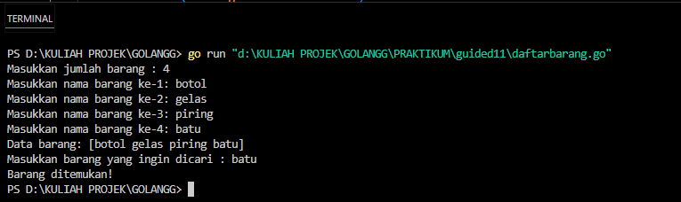
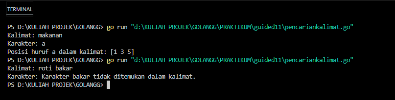
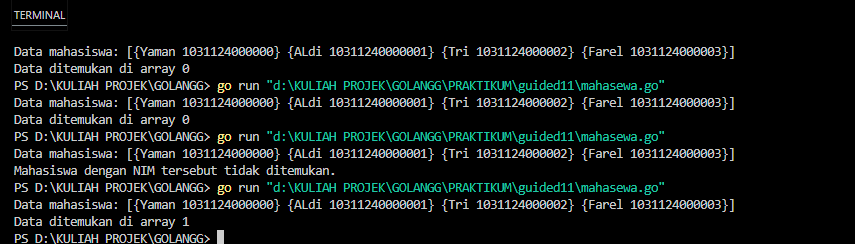
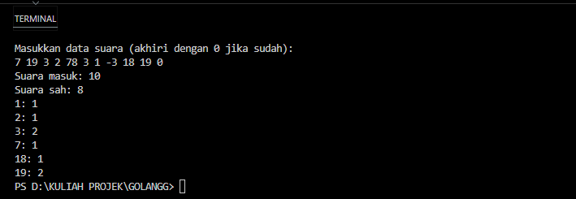
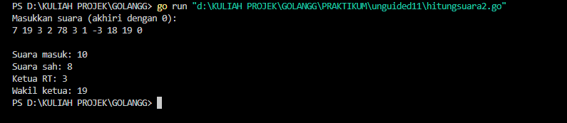
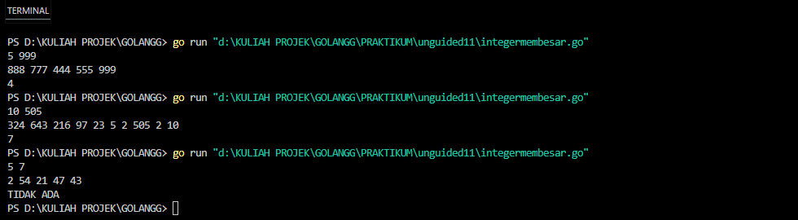

<h1 align="center"> Laporan Praktikum Modul 11 - Pencarian Nilai Acak Pada Himpunan Data </h1>

Nama : Rifa Cahya Ariby 
NIM : 103112400268

# Dasar Teori

**Pencarian Nilai Acak pada Himpunan Data** dalam algoritma pemrograman merupakan proses mencari suatu nilai tertentu (biasanya disebut _key_ atau _target_) secara acak atau tidak terurut dalam sebuah kumpulan data (array, list, atau struktur data lainnya). Berbeda dengan pencarian terurut (_sorted search_) seperti Binary Search, pencarian acak biasanya dilakukan pada data yang tidak terurut (_unsorted_).
Pencarian nilai acak adalah metode untuk menemukan keberadaan atau posisi suatu nilai dalam himpunan data dengan memeriksa elemen-elemen satu per satu secara sekuensial (berurutan) atau acak, tanpa memanfaatkan pengurutan data terlebih dahulu.

### Guided
#### Soal 1

#### code
``` go
package main

import "fmt"

type array []string

func dataBarang(n int) array {
	var barang string
	var arrayBarang array

	for i := 0; i < n; i++ {
		fmt.Print("Masukkan nama barang ke-", i+1, ": ")
		fmt.Scan(&barang)
		arrayBarang = append(arrayBarang, barang)
	}
	return arrayBarang
}

func cariArray(arrayBarang array, x string) bool {
	for i := 0; i < len(arrayBarang); i++ {
		if arrayBarang[i] == x {
			return true
		}
	}
	return false
}

func main() {
	var n int
	var x string

	fmt.Print("Masukkan jumlah barang : ")
	fmt.Scan(&n)

	data := dataBarang(n)
	fmt.Println("Data barang:", data)

	fmt.Print("Masukkan barang yang ingin dicari : ")
	fmt.Scan(&x)

	barang := cariArray(data, x)

	if barang {
		fmt.Println("Barang ditemukan!")
	} else {
		fmt.Println("Barang tidak ditemukan.")
	}
}
```

#### output


#### penjelasan
Program ini meminta pengguna memasukkan jumlah barang, lalu input nama-nama barang tersebut satu per satu dan menyimpannya dalam sebuah list. Setelah itu, program meminta nama barang yang ingin dicari, lalu memeriksa apakah barang tersebut ada di dalam list. Jika ada, program menampilkan "Barang ditemukan!", jika tidak, menampilkan "Barang tidak ditemukan."

#### Soal 2

#### code
``` go
package main

import "fmt"

func pencarianHuruf(kalimat string, karakter string) []int {

    var posisi []int
  
    for i := 0; i < len(kalimat); i++ {

        if kalimat[i] == karakter[0] {

            posisi = append(posisi, i)

        }

    }

    return posisi

}

func main() {

    var kalimat, karakter string
  
    fmt.Print("Kalimat: ")

    fmt.Scan(&kalimat)


    fmt.Print("Karakter: ")

    fmt.Scan(&karakter)

  

    posisi := pencarianHuruf(kalimat, karakter)

  

    if len(posisi) > 0 {

        fmt.Println("Posisi huruf", karakter, "dalam kalimat:", posisi)

    } else {

        fmt.Println("Karakter", karakter, "tidak ditemukan dalam kalimat.")

    }

}
```
#### output

#### penjelasan
Program di atas adalah program Go yang berfungsi untuk mencari posisi kemunculan sebuah karakter dalam sebuah kalimat. Pertama Program meminta pengguna memasukkan sebuah kalimat dan sebuah karakter.
Fungsi `pencarianHuruf` akan memeriksa setiap huruf dalam kalimat, lalu mencatat indeks (posisi) setiap kali huruf tersebut sama dengan karakter yang dicari. Hasilnya adalah daftar posisi karakter tersebut dalam kalimat. Jika karakter ditemukan, program menampilkanposisi-posisi kemunculannya. Jika tidak ditemukan, program menampilkan pesan bahwa karakter tersebut tidak ada dalam kalimat.

### Soal 3

#### code
``` go
package main

import "fmt"
  
type Mahasiswa struct {

    nama string

    nim  string

}

  
func binarySearch(mahasiswa []Mahasiswa, nimCari string) int {

    kiri := 0

    kanan := len(mahasiswa) - 1

  
    for kiri <= kanan {

        mid := (kiri + kanan) / 2

        if mahasiswa[mid].nim == nimCari {

            return mid

        } else if mahasiswa[mid].nim < nimCari {

            kiri = mid + 1

        } else {

            kanan = mid - 1

        }

    }

  

    return -1

}

  
func main() {

    var X string
    
    
    mahasiswa := []Mahasiswa{

        {nama: "Yaman", nim: "1031124000000"},

        {nama: "ALdi", nim: "10311240000001"},

        {nama: "Tri", nim: "1031124000002"},

        {nama: "Farel", nim: "1031124000003"},
    }

    X = "10311240000001"

    fmt.Println("Data mahasiswa:", mahasiswa)

    index := binarySearch(mahasiswa, X)

    if index != -1 {

        fmt.Printf("Data ditemukan di array %d\n", index)

    } else {

        fmt.Println("Mahasiswa dengan NIM tersebut tidak ditemukan.")

    }

}
```
#### output

#### penjelasan
Program di atas mencari data mahasiswa berdasarkan NIM menggunakan binary search. Data mahasiswa disimpan dalam slice yang berisi struct dengan nama dan NIM. Fungsi `binarySearch` mencari indeks mahasiswa dengan NIM yang dicari. Jika ditemukan, program menampilkan posisi mahasiswa dalam array, jika tidak, menampilkan pesan bahwa data tidak ditemukan. 

## Unguided

### Soal 1
1) Pada pemilihan ketua RT yang baru saja berlangsung, terdapat 20 calon ketua yang bertanding memperebutkan suara warga. Perhitungan suara dapat segera dilakukan karena warga cukup mengisi formulir dengan nomor dari calon ketua RT yang dipilihnya. Seperti biasa, selalu ada pengisian yang tidak tepat atau dengan nomor pilihan di luar yang tersedia, sehingga data juga harus divalidasi. Tugas Anda untuk membuat program mencari siapa yang memenangkan pemilihan ketua RT. Buatlah program pilkart yang akan membaca, memvalidasi, dan menghitung suara yang diberikan dalam pemilihan ketua RT tersebut. 
   **Masukan** hanya satu baris data saja, berisi bilangan bulat valid yang kadang tersisipi dengan data tidak valid. Data valid adalah integer dengan nilai di antara 1 s.d. 20 (inklusif). Data berakhir jika ditemukan sebuah bilangan dengan nilai 0. 
   **Keluaran** dimulai dengan baris berisi jumlah data suara yang terbaca, diikuti baris yang berisi berapa banyak suara yang valid. Kemudian sejumlah baris yang mencetak data para calon apa saja yang mendapatkan suara.

| No  | Masukan                    | Keluaran                                                                                                         |
| --- | -------------------------- | ---------------------------------------------------------------------------------------------------------------- |
| 1.  | 7 19 3 2 78 3 1 -3 18 19 0 | Suara masuk: 10<br><br>Suara sah: 8 <br><br>1: 1 <br><br>2: 1<br><br>3: 2<br><br>7: 1<br><br>18: 1 <br><br>19: 2 |

#### code
``` go
package main

import "fmt"

const calonketua = 20

var suara [calonketua]int

func main() {

    fmt.Println("Masukkan data suara (akhiri dengan 0 jika sudah):")

    n := isisuara()

    hitungdantampilkan(n)

}
  

func isisuara() int {

    var i, x int

    for {

        fmt.Scan(&x)

        if x == 0 {

            break

        }

        suara[i] = x

        i++

    }

    return i // jumlah suara masuk

}
  

func hitungdantampilkan(n int) {

    var totalsah int

    hitung := make(map[int]int)

  

    for i := 0; i < n; i++ {

        if suara[i] >= 1 && suara[i] <= 20 {

            hitung[suara[i]]++

            totalsah++

        }

    }


    fmt.Println("Suara masuk:", n)
    fmt.Println("Suara sah:", totalsah)

    for i := 1; i <= 20; i++ {

        if hitung[i] > 0 {

            fmt.Printf("%d: %d\n", i, hitung[i])

        }

    }

}
```

#### output


### penjelasan
Program ini adalah program sederhana untuk menghitung dan menampilkan jumlah suara yang masuk untuk calon ketua dari 1 sampai 20. Program meminta input suara (nomor calon) berulang kali sampai input 0 (berhenti). Suara disimpan dalam array `suara`. Fungsi `hitungdantampilkan` menghitung suara sah (nomor calon antara 1-20) dan menampilkan total suara serta jumlah suara per calon.


### Soal 2

2) Berdasarkan program sebelumnya, buat program pilkart yang mencari siapa pemenang pemilihan ketua RT. Sekaligus juga ditentukan bahwa wakil ketua RT adalah calon yang mendapatkan suara terbanyak kedua. Jika beberapa calon mendapatkan suara terbanyak yang sama, ketua terpilih adalah dengan nomor peserta yang paling kecil dan wakilnya dengan nomor peserta terkecil berikutnya. 
   **Masukan** hanya satu baris data saja, berisi bilangan bulat valid yang kadang tersisipi dengan data tidak valid. Data valid adalah bilangan bulat dengan nilai di antara 1 s.d. 20 (inklusif). Data berakhir jika ditemukan sebuah bilangan dengan nilai 0. **Keluaran** dimulai dengan baris berisi jumlah data suara yang terbaca, diikuti baris yang berisi berapa banyak suara yang valid. Kemudian tercetak calon nomor berapa saja yang menjadi pasangan ketua RT dan wakil ketua RT yang baru.
   
| No  | Masukan                    | Keluaran                                                                       |
| --- | -------------------------- | ------------------------------------------------------------------------------ |
| 1.  | 7 19 3 2 78 3 1 -3 18 19 0 | Suara masuk: 10 <br><br>Suara sah: 8<br><br>Ketua RT: 3<br><br>Wakil ketua: 19 |

#### code
``` go
package main

import "fmt"

func main() {

    var input, total int

    suara := make([]int, 21) // index 1–20


    fmt.Println("Masukkan suara (akhiri dengan 0):")

    for {

        fmt.Scan(&input)

        if input == 0 {

            break

        }

        total++

        if input >= 1 && input <= 20 {

            suara[input]++

        }

    }

  

    fmt.Println("\nSuara masuk:", total)

    valid := 0

    for i := 1; i <= 20; i++ {

        valid += suara[i]

    }

    fmt.Println("Suara sah:", valid)

    ketua, wakil := 0, 0

    for i := 1; i <= 20; i++ {

        if suara[i] > suara[ketua] || (suara[i] == suara[ketua] && i < ketua) {

            wakil = ketua

            ketua = i

        } else if suara[i] > suara[wakil] || (suara[i] == suara[wakil] && i < wakil && i != ketua) {
            wakil = i

        }

    }

    if suara[ketua] > 0 {

        fmt.Println("Ketua RT:", ketua)
    }

    if suara[wakil] > 0 {

        fmt.Println("Wakil ketua:", wakil)

    }

}
```
#### output

#### penjelasan
Program ini menerima input suara calon ketua RT dan wakil ketua dengan nomor 1 sampai 20 hingga input 0, lalu menghitung total suara dan suara sah yang valid (nomor 1–20). Setelah itu, program menentukan calon dengan suara terbanyak sebagai ketua dan suara terbanyak kedua sebagai wakil ketua, serta menampilkan hasilnya jika ada suara sah.


### Soal 3

3) Diberikan n data integer positif dalam keadaan terurut membesar dan sebuah integer lain k, apakah bilangan k tersebut ada dalam daftar bilangan yang diberikan? Jika ya, berikan indeksnya, jika tidak sebutkan "TIDAK ADA". 
   
   **Masukan** terdiri dari dua baris. Baris pertama berisi dua buah integer positif, yaitu n dan k. n menyatakan banyaknya data, dimana 1 < n <= 1000000. k adalah bilangan yang ingin dicari. Baris kedua berisi n buah data integer positif yang sudah terurut membesar. 
   **Keluaran** terdiri dari satu baris saja, yaitu sebuah bilangan yang menyatakan posisi data yang dicari (k) dalam kumpulan data yang diberikan. Posisi data dihitung dimulai dari angka 0. Atau memberikan keluaran "TIDAK ADA" jika data k tersebut tidak ditemukan dalam kumpulan. Program yang dibangun harus menggunakan subprogram dengan mengikuti kerangka yang sudah diberikan berikut ini.
   
   package main import "fmt" 
   const NMAX = 1000000 
   var data [NMAX]int func main(){ 
   /* buatlah kode utama yang membaca baris pertama (n dan k). kemudian data diisi oleh prosedur isiArray(n), dan pencarian oleh fungsi posisi(n,k), dan setelah itu output dicetak. */ }
   func isiArray(n int){ 
   /* I.S. terdefinisi integer n, dan sejumlah n data sudah siap pada piranti masukan. F.S. Array data berisi n (<=NMAX) bilangan */ } 
   func posisi(n, k int) int {
    /* mengembalikan posisi k dalam array data dengan n elemen. Posisi dimulai dari posisi 0. Jika tidak ada kembalikan -1 */ }
    
    **contoh masukan dan keluaran**
    
| No  | Masukan                                            | Keluaran  | Penjelasan                                                   |
| --- | -------------------------------------------------- | --------- | ------------------------------------------------------------ |
| 1.  | 12 534 <br>1 3 8 16 32 123 323 323 534 543 823 999 | 8         | Data 534 berada pada<br>posisi ke-8 dihitung dari awal data. |
| 2.  | 12 535 <br>1 3 8 16 32 123 323 323 534 543 823 999 | TIDAK ADA |                                                              |
#### code
``` go
package main

import "fmt"

const NMAX = 1000000

var data [NMAX]int


func main() {

    var n, k int

    fmt.Scan(&n, &k)

    isiArray(n)

    if idx := posisi(n, k); idx != -1 {

        fmt.Println(idx)

    } else {

        fmt.Println("TIDAK ADA")

    }

}
  

func isiArray(n int) {

    for i := 0; i < n; i++ {

        fmt.Scan(&data[i])

    }

}


func posisi(n, k int) int {

    l, r := 0, n-1

    for l <= r {

        m := (l + r) / 2

        if data[m] == k {

            return m

        } else if data[m] < k {

            l = m + 1

        } else {

            r = m - 1

        }

    }

    return -1

}
```
### output


#### penjelasan
Program ini membaca jumlah elemen `n` dan nilai `k` yang akan dicari dalam array `data` yang sudah terurut, kemudian mengisi array tersebut dengan `n` elemen. Selanjutnya, program menggunakan metode binary search untuk mencari posisi indeks nilai `k` dalam array dengan membagi area pencarian secara berulang hingga nilai ditemukan atau dipastikan tidak ada. Jika nilai `k` ditemukan, program mencetak indeksnya; jika tidak, mencetak "TIDAK ADA".
