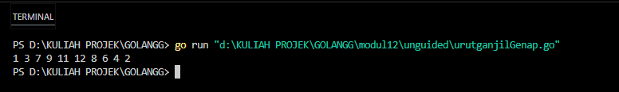
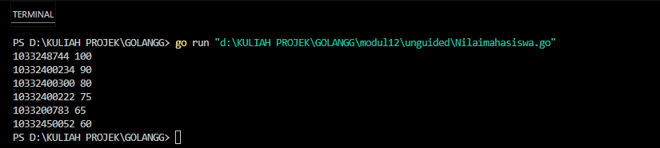
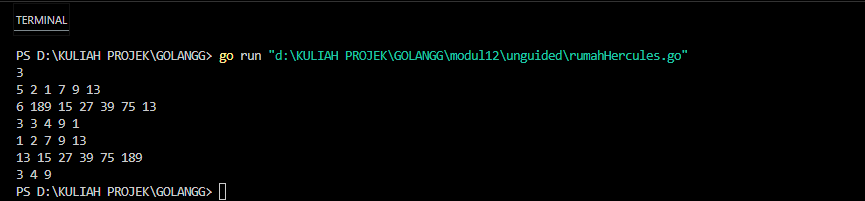
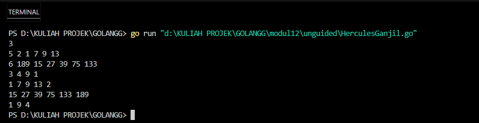
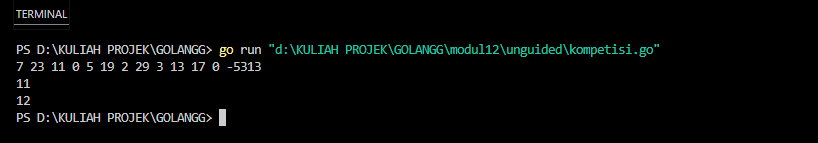
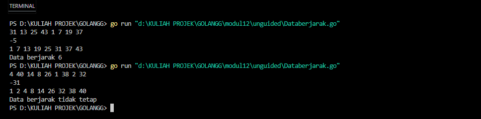
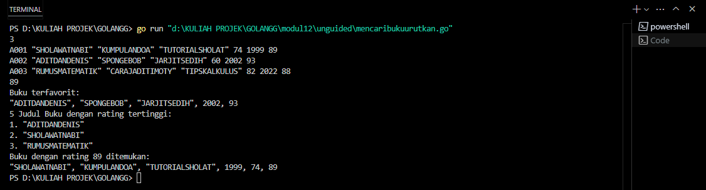

## Laporan Praktikum Modul 12&13 - Pengurutan Data


Nama : Rifa Cahya Ariby 
NIM : 103112400268

## Dasar Teori
Pengurutan Data adalah algoritma sederhana yang bekerja dengan cara berulang kali mencari nilai minimum (atau maksimum) dari bagian array yang belum terurut dan menempatkannya pada posisi yang tepat. Algoritma ini, dikenal sebagai Selection Sort, terdiri dari dua tahap utama: menemukan indeks nilai ekstrim dan menukar posisinya. Dengan pendekatan ini, data secara bertahap terurut dari kiri ke kanan hingga seluruhnya tersusun secara ascending. Meskipun mudah dipahami, metode ini kurang efisien untuk data berukuran besar karena memerlukan banyak perbandingan.

## Guided

## 1. Urut Ganjil Genap
Diberikan `n` bilangan bulat positif. Buat program untuk mengurutkan angka ganjil secara **membesar (ascending)** dan angka genap secara **mengecil (descending)**, lalu gabungkan hasilnya dengan ganjil duluan.
Gunakan **selection sort** dalam proses pengurutan.

**Masukan:**
- Baris pertama berisi bilangan bulat `n` (1 ≤ n ≤ 100).
- Baris kedua berisi `n` bilangan bulat positif.
**Keluaran:**
- Satu baris berisi angka ganjil terurut membesar diikuti angka genap terurut mengecil.

**Contoh Masukan:**

```

10

12 7 3 2 9 6 8 1 11 4

```

**Contoh Keluaran:**

```

1 3 7 9 11 12 8 6 4 2

```

### code
``` go
package main

import "fmt"

func sort(arr []int, i int, asc bool) {

    if i < len(arr)-1 {

        idx := i

        for j := i + 1; j < len(arr); j++ {

            if (asc && arr[j] < arr[idx]) || (!asc && arr[j] > arr[idx]) {

                idx = j

            }

        }

        arr[i], arr[idx] = arr[idx], arr[i]

        sort(arr, i+1, asc)

    }

}

  

func pisah(data []int, i int, ganjil, genap *[]int) {

    if i < len(data) {

        if data[i]%2 == 0 {

            *genap = append(*genap, data[i])

        } else {

            *ganjil = append(*ganjil, data[i])

        }

        pisah(data, i+1, ganjil, genap)

    }

}

  

func cetak(arr []int, i int) {

    if i < len(arr) {

        fmt.Print(arr[i], " ")

        cetak(arr, i+1)

    }

}

  

func main() {

    data := []int{12, 7, 3, 9, 6, 8, 1, 11, 4, 2}

    var ganjil, genap []int

    pisah(data, 0, &ganjil, &genap)

    sort(ganjil, 0, true)

    sort(genap, 0, false)

    cetak(append(ganjil, genap...), 0)

}
```
### output


  Program di atas memisahkan elemen-elemen dalam slice data menjadi dua kelompok, yaitu bilangan ganjil dan genap, menggunakan fungsi rekursif pisah. Setelah dipisahkan, bilangan ganjil diurutkan secara menaik (ascending) dan bilangan genap diurutkan secara menurun (descending) dengan fungsi rekursif sort. Hasil pengurutan dari kedua kelompok tersebut kemudian digabungkan kembali (ganjil di depan, genap di belakang) dan seluruh elemen hasil akhirnya dicetak ke layar secara berurutan menggunakan fungsi rekursif cetak. Program ini menampilkan proses pemisahan, pengurutan, dan pencetakan array dengan pendekatan rekursif pada setiap langkahnya.

---

### 2. Ranking Nilai Ujian

Sebuah kelas memiliki sejumlah siswa yang telah mengikuti ujian. Tugas Anda adalah membuat program yang membaca nilai-nilai ujian siswa dengan struct berisikan `nim` dan `nilai`, lalu mengurutkannya dari yang tertinggi ke yang terendah menggunakan **insertion sort**.

**Masukan:**
- Baris pertama adalah sebuah bilangan bulat `n` (1 ≤ n ≤ 100), menyatakan jumlah siswa.
- Baris berikutnya berisi `n` bilangan bulat yang masing-masing adalah nilai ujian (0–100).
**Keluaran:**
- Satu baris berisi nilai-nilai yang sudah terurut dari terbesar ke terkecil.

**Contoh Masukan:**
  
```

6

75 60 90 80 100 65

```

**Contoh Keluaran:**

```

100 90 80 75 65 60

```

### code
``` go
package main

import "fmt"

type Siswa struct {

    Nama  string
    Nilai int

}

func insertionSort(data []Siswa, n int) {

    if n <= 1 {

        return

    }

    insertionSort(data, n-1)

    last := data[n-1]

    j := n - 2

    for j >= 0 && data[j].Nilai < last.Nilai {

        data[j+1] = data[j]

        j--

    }

    data[j+1] = last

}

func cetakData(data []Siswa, i int) {

    if i == len(data) {

        return

    }

    fmt.Printf("%s %d\n", data[i].Nama, data[i].Nilai)

    cetakData(data, i+1)

}

func main() {

    n := 6

    nilaiMasuk := []int{75, 60, 90, 80, 100, 65}

    namaSiswa := []string{"10332400222", "10332450052", "10332400234", "10332400300", "1033248744", "1033200783"}  

    siswa := make([]Siswa, n)

    for i := 0; i < n; i++ {

        siswa[i] = Siswa{

            Nama:  namaSiswa[i],

            Nilai: nilaiMasuk[i],

        }

    }

    insertionSort(siswa, n)

    cetakData(siswa, 0)

}
```
### output


Program Go di atas mendefinisikan struct siswa yang memiliki atribut nim dan nilai . Dalam fungsi main, dua slice berisi nama siswa dan nilai mereka diinisialisasi, lalu data tersebut dimasukkan ke slice bertipe siswa. Selanjutnya, data siswa diurutkan secara menurun berdasarkan nilai menggunakan algoritma rekursif insertion sort pada fungsi insertionsort. Setelah proses pengurutan selesai, fungsi rekursif cetakdata digunakan untuk mencetak nama dan nilai setiap siswa yang sudah diurutkan dari nilai tertinggi ke terendah. Program ini menampilkan urutan siswa beserta nilainya, dimulai dari siswa dengan nilai tertinggi.

## Unguided

### SelectionSort
### Soal 1

1) Hercules, preman terkenal seantero ibukota, memiliki kerabat di banyak daerah. Tentunya Hercules sangat suka mengunjungi semua kerabatnya itu. Diberikan masukan nomor rumah dari semua kerabatnya di suatu daerah, buatlah program rumahkerabat yang akan menyusun nomor-nomor rumah kerabatnya secara terurut membesar menggunakan algoritma selection sort.
    **Masukan** dimulai dengan sebuah integer 𝒏 (0 < n < 1000), banyaknya daerah kerabat Hercules tinggal. Isi 𝒏 baris berikutnya selalu dimulai dengan sebuah integer 𝒎 (0 < m < 1000000) yang menyatakan banyaknya rumah kerabat di daerah tersebut, diikuti dengan rangkaian bilangan bulat positif, nomor rumah para kerabat. 
    **Keluaran** terdiri dari n baris, yaitu rangkaian rumah kerabatnya terurut membesar di masingmasing daerah.
    
| No  | Masukan                                                  | Keluaran                                     |
| --- | -------------------------------------------------------- | -------------------------------------------- |
| 1.  | 3 <br>5 2 1 7 9 13 <br>6 189 15 27 39 75 13<br>3 3 4 9 1 | 1 2 7 9 13 <br>15 27 39 75 133 189 <br>1 4 9 |

**Keterangan**: Terdapat 3 daerah dalam contoh input, dan di masing-masing daerah mempunyai 5, 6, dan 3 kerabat.

### code
``` go
package main

import "fmt"

func selectionSort(arr []int, n int) {

    var i, j, idxMin, temp int

    for i = 0; i < n-1; i++ {

        idxMin = i

        for j = i + 1; j < n; j++ {

            if arr[j] < arr[idxMin] {

                idxMin = j

            }

        }

        temp = arr[i]

        arr[i] = arr[idxMin]

        arr[idxMin] = temp

    }

}

  

func main() {

    var n, m, i, j int

    fmt.Scan(&n)

  

    var rumah [1000][1000]int   // Maksimal 1000 daerah dan 1000 rumah per daerah

    var banyak [1000]int        // Menyimpan jumlah rumah tiap daerah

  

    for i = 0; i < n; i++ {

        fmt.Scan(&m)

        banyak[i] = m

        for j = 0; j < m; j++ {

            fmt.Scan(&rumah[i][j])

        }

    }

  

    for i = 0; i < n; i++ {

        selectionSort(rumah[i][:banyak[i]], banyak[i])

        for j = 0; j < banyak[i]; j++ {

            fmt.Print(rumah[i][j], " ")

        }

        fmt.Println()

    }

}
```
### output


### penjelasan
Program duatas membaca data beberapa daerah, di mana setiap daerah memiliki sejumlah rumah dengan nomor tertentu. Untuk setiap daerah, program menerima input jumlah rumah dan nomor-nomor rumahnya, lalu mengurutkan nomor rumah di setiap daerah secara menaik menggunakan algoritma fungsi selectionsort. Setelah diurutkan, nomor rumah di setiap daerah dicetak ke layar, satu baris per daerah. Program ini menggunakan array dua dimensi untuk menyimpan nomor rumah di setiap daerah dan array satu dimensi untuk menyimpan jumlah rumah per daerah. Dengan demikian, output program adalah daftar nomor rumah yang sudah terurut untuk setiap daerah sesuai input yang diberikan.

### Soal 2

2) Belakangan diketahui ternyata Hercules itu tidak berani menyeberang jalan, maka selalu diusahakan agar hanya menyeberang jalan sesedikit mungkin, hanya diujung jalan. Karena nomor rumah sisi kiri jalan selalu ganjil dan sisi kanan jalan selalu genap, maka buatlah program kerabat dekat yang akan menampilkan nomor rumah mulai dari nomor yang ganjil lebih dulu terurut membesar dan kemudian menampilkan nomor rumah dengan nomor genap terurut mengecil. 
   
   Format **Masukan** masih persis sama seperti sebelumnya.
    **Keluaran** terdiri dari n baris, yaitu rangkaian rumah kerabatnya terurut membesar untuk nomor ganjil, diikuti dengan terurut mengecil untuk nomor genap, di masing-masing daerah.

| No  | Masukan                                                  | Keluaran                                     |
| --- | -------------------------------------------------------- | -------------------------------------------- |
| 1.  | 3 <br>5 2 1 7 9 13 <br>6 189 15 27 39 75 133 <br>3 4 9 1 | 1 13 12 8 2 <br>15 27 39 75 133 189<br>8 4 2 |

**Keterangan**: Terdapat 3 daerah dalam contoh masukan. Baris kedua berisi campuran bilangan ganjil dan genap. Baris berikutnya hanya berisi bilangan ganjil, dan baris terakhir hanya berisi bilangan genap. **Petunjuk**: 
    • Waktu pembacaan data, bilangan ganjil dan genap dipisahkan ke dalam dua array yang berbeda, untuk kemudian masing-masing diurutkan tersendiri.
    • Atau, tetap disimpan dalam satu array, diurutkan secara keseluruhan. Tetapi pada waktu pencetakan, mulai dengan mencetak semua nilai ganjil lebih dulu, kemudian setelah selesai cetaklah semua nilai genapnya.

### code
```go
package main

import "fmt"

func selectionSortAsc(arr []int) {
	var i, j, minIdx, temp int
	for i = 0; i < len(arr)-1; i++ {
		minIdx = i
		for j = i + 1; j < len(arr); j++ {
			if arr[j] < arr[minIdx] {
				minIdx = j
			}
		}
		temp = arr[i]
		arr[i] = arr[minIdx]
		arr[minIdx] = temp
	}
}

func selectionSortDesc(arr []int) {
	var i, j, maxIdx, temp int
	for i = 0; i < len(arr)-1; i++ {
		maxIdx = i
		for j = i + 1; j < len(arr); j++ {
			if arr[j] > arr[maxIdx] {
				maxIdx = j
			}
		}
		temp = arr[i]
		arr[i] = arr[maxIdx]
		arr[maxIdx] = temp
	}
}

func prosesDaerah(m int) []int {
	var i int
	var rumah []int = make([]int, m)
	var ganjil, genap []int

	for i = 0; i < m; i++ {
		fmt.Scan(&rumah[i])
	}

	for i = 0; i < m; i++ {
		if rumah[i]%2 == 1 {
			ganjil = append(ganjil, rumah[i])
		} else {
			genap = append(genap, rumah[i])
		}
	}

	selectionSortAsc(ganjil)
	selectionSortDesc(genap)

	var hasil []int = append(ganjil, genap...)
	return hasil
}

func cetakHasil(hasil [][]int) {
	var i, j int
	for i = 0; i < len(hasil); i++ {
		for j = 0; j < len(hasil[i]); j++ {
			fmt.Print(hasil[i][j], " ")
		}
		fmt.Println()
	}
}

func main() {
	var n, i, m int
	var hasil [][]int

	fmt.Scan(&n)

	for i = 0; i < n; i++ {
		fmt.Scan(&m)
		hasil = append(hasil, prosesDaerah(m))
	}
	cetakHasil(hasil)
}

```
### output


### penjelasan
Program ini digunakan untuk mengurutkan dan menampilkan deretan angka dari beberapa kelompok data (daerah). Untuk setiap kelompok, program akan memisahkan angka menjadi dua kategori: **ganjil** dan **genap**. Angka-angka ganjil akan diurutkan secara **menaik** (dari kecil ke besar), sedangkan angka-angka genap akan diurutkan secara **menurun** (dari besar ke kecil). Setelah itu, hasil pengurutan akan dicetak dalam satu baris, dengan angka ganjil di depan diikuti angka genap


### Soal 3

3) Kompetisi pemrograman yang baru saja berlalu diikuti oleh 17 tim dari berbagai perguruan tinggi ternama. Dalam kompetisi tersebut, setiap tim berlomba untuk menyelesaikan sebanyak mungkin problem yang diberikan. Dari 13 problem yang diberikan, ada satu problem yang menarik. Problem tersebut mudah dipahami, hampir semua tim mencoba untuk menyelesaikannya, tetapi hanya 3 tim yang berhasil. Apa sih problemnya?
    *"Median adalah nilai tengah dari suatu koleksi data yang sudah terurut. Jika jumlah data genap, maka nilai median adalah rerata dari kedua nilai tengahnya. Pada problem ini, semua data merupakan bilangan bulat positif, dan karenanya rerata nilai tengah dibulatkan ke bawah."*

	 Buatlah program median yang mencetak nilai median terhadap seluruh data yang sudah terbaca, jika data yang dibaca saat itu adalah 0.
	 **Masukan** berbentuk rangkaian bilangan bulat. Masukan tidak akan berisi lebih dari 1000000 data, tidak termasuk bilangan 0. Data 0 merupakan tanda bahwa median harus dicetak, tidak termasuk data yang dicari mediannya. Data masukan diakhiri dengan bilangan bulat -5313. 
	 **Keluaran** adalah median yang diminta, satu data per baris
	 

| No  | Masukan                               | Keluaran |
| --- | ------------------------------------- | -------- |
| 1.  | 7 23 11 0 5 19 2 29 3 13 17 0   -5313 | 11<br>12 |
**Keterangan**: Sampai bilangan 0 yang pertama, data terbaca adalah 7 23 11, setelah tersusun: 7 11 23, maka median saat itu adalah 11
Sampai bilangan 0 yang kedua, data adalah 7 23 11 5 19 2 29 3 13 17, setelah tersusun diperoleh: 2 3 5 7 **11 13** 17 19 23 29. Karena ada 10 data, genap, maka median adalah (11+13)/2=12. 
**Petunjuk**: Untuk setiap data bukan 0 (dan bukan marker -5313541) simpan ke dalam array, Dan setiap kali menemukan bilangan 0, urutkanlah data yang sudah tersimpan dengan menggunakan metode insertion sort dan ambil mediannya.

### code
``` go
package main

import "fmt"

func urutkanPilihan(data []int) {

    jumlahData := len(data)

    for i := 0; i < jumlahData-1; i++ {

        indeksTerkecil := i

        for j := i + 1; j < jumlahData; j++ {

            if data[j] < data[indeksTerkecil] {

                indeksTerkecil = j

            }

        }

        data[i], data[indeksTerkecil] = data[indeksTerkecil], data[i]

    }

}

  

func hitungMedian(data []int) int {

    urutkanPilihan(data)

    panjang := len(data)

    if panjang == 0 {

        return 0

    }

    if panjang%2 == 1 {

        return data[panjang/2]

    } else {

        return (data[panjang/2-1] + data[panjang/2]) / 2

    }

}

  

func main() {

    var kumpulanData []int

    var masukan int

    for {

        fmt.Scan(&masukan)

        if masukan == -5313 {

            break

        }

        if masukan == 0 {

            if len(kumpulanData) > 0 {

                nilaiMedian := hitungMedian(kumpulanData)

                fmt.Println(nilaiMedian)

            }

            continue

        }

        kumpulanData = append(kumpulanData, masukan)

    }

}
```
### output


### penjelasan
Program pada gambar terminal tersebut meminta input jumlah kelompok data, lalu untuk setiap kelompok, pengguna memasukkan sejumlah angka yang kemudian dipisahkan menjadi bilangan ganjil dan genap. Bilangan ganjil diurutkan secara menaik, sedangkan bilangan genap diurutkan secara menurun. Setelah proses pengurutan, hasilnya dicetak dengan urutan bilangan ganjil terlebih dahulu diikuti bilangan genap, satu baris untuk setiap kelompok data. Program ini memudahkan pengguna untuk melihat data yang sudah terkelompok dan terurut sesuai kriteria ganjil-genap pada setiap kelompok yang dimasukkan.


### InsertionSort
### Soal 1

1) Buatlah sebuah program yang digunakan untuk membaca data integer seperti contoh yang diberikan di bawah ini, kemudian diurutkan (menggunakan metoda insertion sort), dan memeriksa apakah data yang terurut berjarak sama terhadap data sebelumnya. 
   
   **Masukan** terdiri dari sekumpulan bilangan bulat yang diakhiri oleh bilangan negatif. Hanya bilangan non negatif saja yang disimpan ke dalam array. 
   
   **Keluaran** terdiri dari dua baris. Baris pertama adalah isi dari array setelah dilakukan pengurutan, sedangkan baris kedua adalah status jarak setiap bilangan yang ada di dalam array. "Data berjarak x" atau "data berjarak tidak tetap". 
   
   **Contoh masukan dan keluaran**

| No  | Masukan                    | Keluaran                                             |
| --- | -------------------------- | ---------------------------------------------------- |
| 1.  | 31 13 25 43 1 7 19 37 -5   | 1 7 13 19 25 31 37 43<br>Data berjarak 6             |
| 2.  | 4 40 14 8 26 1 38 2 32 -31 | 1 2 4 8 14 26 32 38 40 <br>Data berjarak tidak tetap |
### code
 ``` go
package main

import "fmt"
  
func insertionSort(arr []int) {

    for i := 1; i < len(arr); i++ {

        key := arr[i]

        j := i - 1

        for j >= 0 && arr[j] > key {

            arr[j+1] = arr[j]

            j--

        }

        arr[j+1] = key

    }

}

  

func cekJarak(arr []int) string {

    if len(arr) <= 1 {

        return "Data berjarak tidak tetap"

    }

  

    jarak := arr[1] - arr[0]

    for i := 2; i < len(arr); i++ {

        if arr[i]-arr[i-1] != jarak {

            return "Data berjarak tidak tetap"

        }

    }

  

    return fmt.Sprintf("Data berjarak %d", jarak)

}

  

func main() {

    var data []int

    var input int

    for {

        fmt.Scan(&input)

        if input < 0 {

            break

        }

        data = append(data, input)

    }

  

    insertionSort(data)

  

    for i, num := range data {

        if i > 0 {

            fmt.Print(" ")

        }

        fmt.Print(num)

    }

    fmt.Println()

    fmt.Println(cekJarak(data))

}
```
### output

### penjelasan
Program Go ini membaca sejumlah bilangan bulat positif dari input hingga ditemukan angka negatif sebagai tanda berhenti. Setelah itu, program mengurutkan data menggunakan algoritma insertion sort secara menaik. Kemudian, program mencetak data yang sudah terurut dan memeriksa apakah data tersebut memiliki selisih (jarak) antar elemen yang konstan. Fungsi `cekJarak` mengecek perbedaan antara elemen berurutan; jika semua selisih sama, program mencetak pesan yang menunjukkan nilai jarak tersebut, dan jika tidak, mencetak bahwa data berjarak tidak tetap. Dengan demikian, program ini tidak hanya mengurutkan data, tetapi juga menentukan apakah data tersebut membentuk deret aritmatika dengan jarak tetap.

### Soal 2

2) Sebuah program perpustakaan digunakan untuk mengelola data buku di dalam suatu perpustakaan. Misalnya terdefinisi struct dan array seperti berikut ini: 
``` go
   const nMax : integer = 7919
    type Buku = < 
	    id, judul, penulis, penerbit : string 
	    eksemplar, tahun, rating : integer > 
	    type DaftarBuku = array [ 1..nMax] of Buku
	    Pustaka : DaftarBuku 
	    nPustaka: integer
```

**Masukan** terdiri dari beberapa baris. Baris pertama adalah bilangan bulat N yang menyatakan banyaknya data buku yang ada di dalam perpustakaan. N baris berikutnya, masing-masingnya adalah data buku sesuai dengan atribut atau field pada struct. Baris terakhir adalah bilangan bulat yang menyatakan rating buku yang akan dicari.
**Keluaran** terdiri dari beberapa baris. Baris pertama adalah data buku terfavorit, baris kedua adalah lima judul buku dengan rating tertinggi, selanjutnya baris terakhir adalah data buku yang dicari sesuai rating yang diberikan pada masukan baris terakhir.
Lengkapi subprogram-subprogram dibawah ini, sesuai dengan I.S. dan F.S yang diberikan

```
procedure DaftarkanBuku(in/out pustaka : DaftarBuku, n : integer)
{I.S. sejumlah n data buku telah siap pada piranti masukan 
  F.S. n berisi sebuah nilai, dan pustaka berisi sejumlah n data buku}

procedure CetakTerfavorit(in pustaka : DaftarBuku, in n : integer)
{I.S. array pustaka berisi n buah data buku dan belum terurut 
  F.S. Tampilan data buku (judul, penulis, penerbit, tahun) terfavorit, 
       yaitu memiliki rating tertinggi}

procedure UrutBuku(in/out pustaka : DaftarBuku, n : integer)
{I.S. Array pustaka berisi n data buku 
  F.S. Array pustaka terurut menurun/mengecil terhadap rating 
  Catatan: Gunakan metoda Insertion sort}

procedure Cetak5Terbaru(in pustaka : DaftarBuku, n : integer)
{I.S. pustaka berisi n data buku yang sudah terurut menurut rating 
  F.S. Laporan 5 judul buku dengan rating tertinggi 
  Catatan: Isi pustaka mungkin saja kurang dari 5 }

procedure CariBuku(in pustaka : DaftarBuku, n : integer, r : integer)
{I.S. pustaka berisi n data buku yang sudah terurut menurut rating F.S. Laporan salah satu buku (judul, penulis, penerbit, tahun, eksemplar, rating) dengan rating yang diberikan. Jika tidak ada buku dengan rating yang ditanyakan,cukup tuliskan “Tidak ada buku dengan rating seperti itu”.Catatan: Gunakan pencarian biner/belah dua }
```

### code
``` go
package main

import "fmt"

const nMax = 7919

type Buku struct {

    id, judul, penulis, penerbit string

    eksemplar, tahun, rating     int

}

  

type DaftarBuku [nMax]Buku

func DaftarkanBuku(pustaka *DaftarBuku, n *int) {

    var buku Buku

    var i int

    fmt.Scan(&(*n))

    for i = 0; i < *n; i++ {

        fmt.Scan(&buku.id, &buku.judul, &buku.penulis, &buku.penerbit, &buku.eksemplar, &buku.tahun, &buku.rating)

        (*pustaka)[i] = buku

    }

}

  

func CetakTerfavorit(pustaka DaftarBuku, n int) {

    var terfavorit Buku

    var i int

    terfavorit = pustaka[0]

    for i = 1; i < n; i++ {

        if pustaka[i].rating > terfavorit.rating {

            terfavorit = pustaka[i]

        }

    }

    fmt.Println("Buku terfavorit:")

    fmt.Printf("%s, %s, %s, %d, %d\n", terfavorit.judul, terfavorit.penulis, terfavorit.penerbit, terfavorit.tahun, terfavorit.rating)

}

  

func UrutBuku(pustaka *DaftarBuku, n int) {

    var i, j int

    var temp Buku

    for i = 1; i < n; i++ {

        temp = (*pustaka)[i]

        j = i - 1

        for j >= 0 && (*pustaka)[j].rating < temp.rating {

            (*pustaka)[j+1] = (*pustaka)[j]

            j--

        }

        (*pustaka)[j+1] = temp

    }

}

  

func Cetak5Terbaru(pustaka DaftarBuku, n int) {

    var i int

    if n > 5 {

        n = 5

    }

    fmt.Println("5 Judul Buku dengan rating tertinggi:")

    for i = 0; i < n; i++ {

        fmt.Printf("%d. %s\n", i+1, pustaka[i].judul)

    }

}

  

func CariBuku(pustaka DaftarBuku, n int, r int) {

    var kiri, kanan, tengah int

    var ditemukan bool

    kiri = 0

    kanan = n - 1

    ditemukan = false

    for kiri <= kanan {

        tengah = (kiri + kanan) / 2

        if pustaka[tengah].rating == r {

            fmt.Printf("Buku dengan rating %d ditemukan:\n", r)

            fmt.Printf("%s, %s, %s, %d, %d, %d\n", pustaka[tengah].judul, pustaka[tengah].penulis, pustaka[tengah].penerbit, pustaka[tengah].tahun, pustaka[tengah].eksemplar, pustaka[tengah].rating)

            ditemukan = true

            break

        } else if pustaka[tengah].rating < r {

            kanan = tengah - 1

        } else {

            kiri = tengah + 1

        }

    }

    if !ditemukan {

        fmt.Println("Tidak ada buku dengan rating seperti itu")

    }

}

  

func main() {

    var pustaka DaftarBuku

    var nPustaka, ratingCari int

  

    DaftarkanBuku(&pustaka, &nPustaka)

    fmt.Scan(&ratingCari)

    UrutBuku(&pustaka, nPustaka)

    CetakTerfavorit(pustaka, nPustaka)

    Cetak5Terbaru(pustaka, nPustaka)

    CariBuku(pustaka, nPustaka, ratingCari)

}
```

### output



### penjelasan
Program Go ini mengelola data buku dalam sebuah perpustakaan dengan menggunakan array statis Daftarbuku berkapasitas maksimum 7919 buku. Program menerima input berupa jumlah buku (jumlahbuku) dan data masing-masing buku yang terdiri dari id, judul, penulis, penerbit, ekslempar, tahun, dan rating. Fungsi `DaftarkanBuku` mengisi array dengan data buku dari input pengguna. Setelah itu, fungsi `CetakTerfavorit` mencari dan menampilkan buku dengan rating tertinggi berdasarkan data yang sudah dimasukkan. Fungsi `UrutBuku` mengurutkan buku dalam array secara menurun berdasarkan rating menggunakan algoritma insertion sort. Kemudian, fungsi `Cetak5Terbaru` mencetak judul lima buku dengan rating tertinggi (atau kurang jika jumlah buku kurang dari lima). Terakhir, program membaca nilai rating yang ingin dicari dan menggunakan fungsi `CariBuku` untuk melakukan pencarian biner pada array yang sudah terurut tersebut, menampilkan detail buku yang memiliki rating sesuai input, atau menampilkan pesan jika tidak ditemukan buku dengan rating tersebut. Program ini secara keseluruhan memproses data buku, mengurutkan, dan mencari buku berdasarkan rating dengan efisien menggunakan teknik pengurutan dan pencarian yang tepat.

