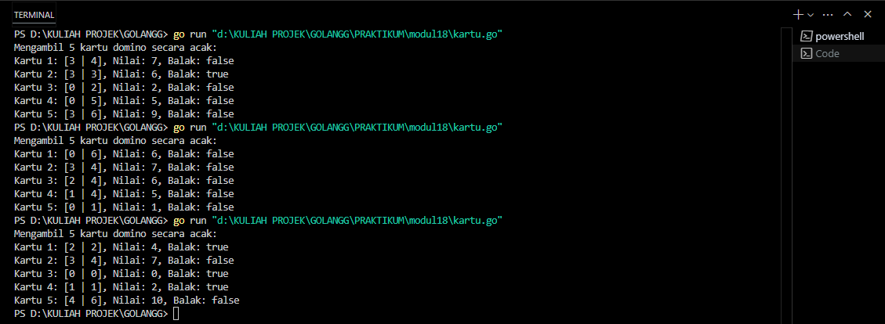
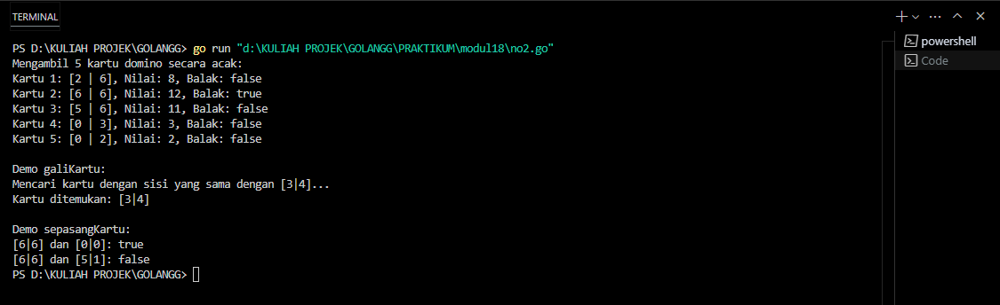
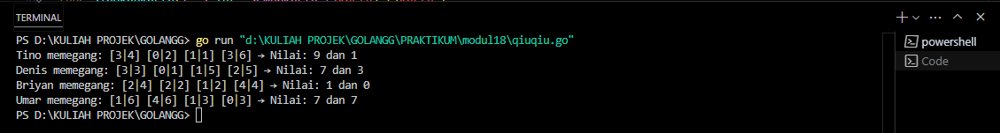
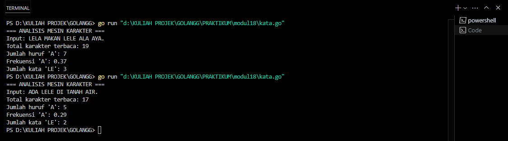

<h1 align=center>Laporan Praktikum Modul 18 - Mesin Abstrak</h1>

Nama : Rifa Cahya Ariby 
NIM : 103112400268

## Dasar Teori
Mesin abstrak adalah gambaran sederhana dari komputer yang digunakan untuk memahami bagaimana algoritma bekerja.
Mesin ini bukan komputer sungguhan, tapi hanya model atau bayangan tentang bagaimana sebuah perintah dijalankan langkah demi langkah. Mesin abstrak membantu kita belajar logika program tanpa harus langsung memikirkan hal teknis seperti bahasa pemrograman atau perangkat keras.

## Unguided
## SOAL 1
1) Implementasi operasi dasar mesin domino sebagai sebuah subprogram: 
   a) Buat tipe data kartu domino (Domino) yang menyimpan informasi 
   ➢ gambar (suit) kedua sisi kartu 
   ➢ nilai kartu 
   ➢ Boolean data yang menyatakan kartu ini balak atau bukan 
   ➢ Buat tipe data satu set kartu domino (Dominoes) 
   ➢ Array menyimpan 28 kartu Domino 
   ➢ Jumlah kartu tersisa dalam array tersebut 
	b) prosedur kocokKartu(Dominoes) 
	c) fungsi ambilKartu(Dominoes) → Domino 
	d) fungsi gambarKartu(Domino,suit int) → int 
	e) fungsi nilaiKartu(Domino) → int
	
	``` go
package main

import (

    "fmt"
    "math/rand"
    "time"
)

type KartuDomino struct {
    sisiKiri    int    
    sisiKanan   int  
    totalNilai  int    
    balak       bool  

}

type SetDomino struct {
    kartu          [28]KartuDomino
    sisaKartu      int

}

func buatSetDomino() SetDomino {

    var set SetDomino

    posisi := 0

        for sisiKiri := 0; sisiKiri <= 6; sisiKiri++ {
        for sisiKanan := sisiKiri; sisiKanan <= 6; sisiKanan++ {
            kartu := KartuDomino{
                sisiKiri:    sisiKiri,
                sisiKanan:   sisiKanan,
                totalNilai:  sisiKiri + sisiKanan,
                balak:       sisiKiri == sisiKanan,
            }

            set.kartu[posisi] = kartu

            posisi++
        }

    }

    set.sisaKartu = 28
    return set

}

func acakKartu(set *SetDomino) {
    rand.Seed(time.Now().UnixNano())
    for i := range set.kartu {
        posisiAcak := rand.Intn(len(set.kartu))
        set.kartu[i], set.kartu[posisiAcak] = set.kartu[posisiAcak], set.kartu[i]
    }
}
func ambilKartu(set *SetDomino) KartuDomino {
    if set.sisaKartu == 0 {
        return KartuDomino{-1, -1, -1, false} // Tidak ada kartu tersisa
    }
    kartu := set.kartu[28-set.sisaKartu]
    set.sisaKartu--
    return kartu

}

func dapatkanNilaiSisi(kartu KartuDomino, sisi int) int {

    if sisi == 0 {
        return kartu.sisiKiri
    } else {
        return kartu.sisiKanan

    }

}

func dapatkanTotalNilai(kartu KartuDomino) int {
    return kartu.totalNilai

}

func main() {
    setDomino := buatSetDomino()
    acakKartu(&setDomino)
  
    fmt.Println("Mengambil 5 kartu domino secara acak:")
    for i := 0; i < 5; i++ {
        kartu := ambilKartu(&setDomino)
        fmt.Printf("Kartu %d: [%d | %d], Nilai: %d, Balak: %t\n",
            i+1, kartu.sisiKiri, kartu.sisiKanan, dapatkanTotalNilai(kartu), kartu.balak)
    }
}
```

## Output

Program diatas merupakan implementasi sederhana permainan kartu domino menggunakan bahasa pemrograman Go, yang bertujuan untuk membuat set kartu domino lengkap, mengacak urutan kartu, serta mengambil dan menampilkan beberapa kartu secara acak sebagai simulasi awal dari permainan domino.

## SOAL 2
2) Realisasi aksi berikut menggunakan operasi-operasi dasar mesin domino: 

	a) prosedur galiKartu(Dominoes,Domino) yang mengambil kartu dari tumpukan sampai diperoleh kartu dengan gambar (suit) yang sama dengan kartu yang diberikan.

	b) fungsi sepasangKartu(Domino,Domino) → boolean; yang memberikan nilai true jika total nilai kartu adalah 12 dan false jika tidak.

``` go
package main

import (
    "fmt"
    "math/rand"
    "time"

)

type KartuDomino struct {
    sisiKiri   int    
    sisiKanan  int  
    totalNilai int    
    balak      bool  
}

type SetDomino struct {
    kartu     [28]KartuDomino
    sisaKartu int

}

  
func main() {
    setDomino := buatSetDomino()
    acakKartu(&setDomino)
    fmt.Println("Mengambil 5 kartu domino secara acak:")
    for i := 0; i < 5; i++ {
        kartu := ambilKartu(&setDomino)
        fmt.Printf("Kartu %d: [%d | %d], Nilai: %d, Balak: %t\n",
            i+1, kartu.sisiKiri, kartu.sisiKanan, kartu.totalNilai, kartu.balak)

    }
    fmt.Println("\nDemo galiKartu:")
    target := KartuDomino{3, 4, 7, false}
    fmt.Printf("Mencari kartu dengan sisi yang sama dengan [%d|%d]...\n", target.sisiKiri, target.sisiKanan)
    kartuDitemukan := galiKartu(&setDomino, target)
    if kartuDitemukan.totalNilai != -1 {
        fmt.Printf("Kartu ditemukan: [%d|%d]\n", kartuDitemukan.sisiKiri, kartuDitemukan.sisiKanan)
    } else {
        fmt.Println("Tidak ditemukan kartu dengan sisi yang sesuai")
    }


    fmt.Println("\nDemo sepasangKartu:")
    kartu1 := KartuDomino{6, 6, 12, true}  
    kartu2 := KartuDomino{0, 0, 0, true}  
    kartu3 := KartuDomino{5, 1, 6, false}  

    fmt.Printf("[6|6] dan [0|0]: %t\n", sepasangKartu(kartu1, kartu2))  
    fmt.Printf("[6|6] dan [5|1]: %t\n", sepasangKartu(kartu1, kartu3))  
}
func buatSetDomino() SetDomino {
    var set SetDomino
    posisi := 0
    for sisiKiri := 0; sisiKiri <= 6; sisiKiri++ {
        for sisiKanan := sisiKiri; sisiKanan <= 6; sisiKanan++ {

            kartu := KartuDomino{
                sisiKiri:   sisiKiri,
                sisiKanan:  sisiKanan,
                totalNilai: sisiKiri + sisiKanan,
                balak:      sisiKiri == sisiKanan,

            }
            set.kartu[posisi] = kartu
            posisi++
        }
    }
    set.sisaKartu = 28
    return set
}

func acakKartu(set *SetDomino) {
    rand.Seed(time.Now().UnixNano())
    for i := range set.kartu {
        posisiAcak := rand.Intn(len(set.kartu))
        set.kartu[i], set.kartu[posisiAcak] = set.kartu[posisiAcak], set.kartu[i]

    }

}


func ambilKartu(set *SetDomino) KartuDomino {
    if set.sisaKartu == 0 {
        return KartuDomino{-1, -1, -1, false}

    }
    kartu := set.kartu[28-set.sisaKartu]
    set.sisaKartu--
    return kartu

}

func galiKartu(set *SetDomino, kartuTarget KartuDomino) KartuDomino {

    for set.sisaKartu > 0 {
        kartu := ambilKartu(set)
        if kartu.sisiKiri == kartuTarget.sisiKiri ||
            kartu.sisiKiri == kartuTarget.sisiKanan ||
            kartu.sisiKanan == kartuTarget.sisiKiri ||
            kartu.sisiKanan == kartuTarget.sisiKanan {
            return kartu
        }
    }
    return KartuDomino{-1, -1, -1, false}
}

func sepasangKartu(kartu1 KartuDomino, kartu2 KartuDomino) bool {
    return (kartu1.totalNilai + kartu2.totalNilai) == 12

}
```

## Output

Program diatas adalah simulasi permainan domino sederhana yang dibuat menggunakan bahasa pemrograman Go. Program ini terdiri dari beberapa bagian utama, yaitu pembuatan set kartu domino lengkap, pengacakan kartu, serta pengambilan dan penampilan beberapa kartu secara acak. Selain itu, program ini juga mendemonstrasikan cara mencari kartu yang memiliki sisi yang sama dengan kartu target menggunakan fungsi galiKartu, serta mengecek apakah dua kartu memiliki total nilai 12 dengan fungsi sepasangKartu. Melalui program ini, pemahaman tentang struktur data, fungsi, dan operasi dasar dalam pemrograman dapat dilatih secara praktis.


3) Implementasi salah satu permainan domino. Lihat lampiran untuk deskripsi permainan Gapleh
``` go
package main

import (
    "fmt"
    "math/rand"
    "time"
)
type Kartu struct {
    kiri, kanan int

}
type Pemain struct {
    nama        string
    kartu       [4]Kartu
    nilai1, nilai2 int
}

func main() {
    rand.Seed(time.Now().UnixNano())
    kumpulanKartu := siapkanKartu(0, 0, []Kartu{})
    acakKartu(&kumpulanKartu)

  

    pemain := []Pemain{
        {nama: "Tino"},
        {nama: "Denis"},
        {nama: "Briyan"},
        {nama: "Umar"},

    }
  
    bagikanKartu(&pemain, &kumpulanKartu, 0)
    tampilkanHasil(pemain, 0)
}
func siapkanKartu(i, j int, semuaKartu []Kartu) []Kartu {
    if i > 6 {
        return semuaKartu
    }
    if j > 6 {
        return siapkanKartu(i+1, i+1, semuaKartu)
    }

    semuaKartu = append(semuaKartu, Kartu{i, j})
    return siapkanKartu(i, j+1, semuaKartu)
}

func acakKartu(kartu *[]Kartu) {
    rand.Shuffle(len(*kartu), func(i, j int) {
        (*kartu)[i], (*kartu)[j] = (*kartu)[j], (*kartu)[i]

    })

}

func ambilKartu(kartu *[]Kartu) Kartu {
    kartuDiambil := (*kartu)[0]
    *kartu = (*kartu)[1:]
    return kartuDiambil

}

  

func bagikanKartu(pemain *[]Pemain, kumpulanKartu *[]Kartu, indeks int) {
    if indeks >= len(*pemain) {
        return
    }

    bagikanKartuKeSatu(&(*pemain)[indeks], kumpulanKartu, 0)
    (*pemain)[indeks].nilai1, (*pemain)[indeks].nilai2 = hitungNilaiKartu((*pemain)[indeks].kartu)
    bagikanKartu(pemain, kumpulanKartu, indeks+1)
}

func bagikanKartuKeSatu(p *Pemain, kumpulanKartu *[]Kartu, i int) {
    if i >= 4 {
        return
    }

    p.kartu[i] = ambilKartu(kumpulanKartu)
    bagikanKartuKeSatu(p, kumpulanKartu, i+1)
}

func hitungNilaiKartu(kartu [4]Kartu) (int, int) {
    hitungTitik := func(k Kartu) int {
        return k.kiri + k.kanan
    }

    n1 := (hitungTitik(kartu[0]) + hitungTitik(kartu[1])) % 10
    n2 := (hitungTitik(kartu[2]) + hitungTitik(kartu[3])) % 10
    if n2 > n1 {
        return n2, n1
    }
    return n1, n2
}


func tampilkanHasil(pemain []Pemain, i int) {
    if i >= len(pemain) {
        return

    }
    p := pemain[i]
    fmt.Printf("%s memegang: ", p.nama)
    tampilkanKartu(p.kartu, 0)
    fmt.Printf("→ Nilai: %d dan %d\n", p.nilai1, p.nilai2)
    tampilkanHasil(pemain, i+1)

}

func tampilkanKartu(kartu [4]Kartu, i int) {
    if i >= 4 {
        return
    }
    fmt.Printf("[%d|%d] ", kartu[i].kiri, kartu[i].kanan)
    tampilkanKartu(kartu, i+1)
}
```

## Output



Program diatas adalah simulasi permainan kartu domino untuk empat pemain, di mana setiap pemain menerima empat kartu acak dari set domino lengkap, lalu dua nilai dihitung dari kartu masing-masing. Nilai tersebut diambil dari penjumlahan dua kartu pertama dan dua kartu berikutnya, dihitung modulo 10, lalu hasilnya ditampilkan untuk setiap pemain.


4) Implementasi mesin abstrak karakter yang bekerja terhadap untaian karakter (yang diakhiri dengan penanda titik (".") dan mempunyai sejumlah operasi dasar. 
	a) Operasi dasar mesin karakter:
	➢ Prosedur start(); yang menyiapkan mesin karakter di awal rangkaian karakter. 
	➢ Prosedur maju(); yang memajukan pembaca ke posisi karakter berikutnya. 
	➢ Fungsi eop(); yang mengembalikan nilai true apabila sudah mencapai akhir rangkaian, sampai ke penanda titik ("."). 
	➢ Fungsi cc(); yang mengembalikan karakter yang sedang terbaca, atau berada pada posisi pembacaan mesin.
	b) Dengan operasi dasar di atas buat algoritma untuk:
	➢ Membaca seluruh karakter yang diberikan ke mesin karakter tersebut. 
	➢ Menghitung berapa banyak karakter yang terbaca. 
	➢ Menghitung ada berapa huruf "A" yang terbaca. 
	➢ Menghitung frekuensi kemunculan huruf "A" terhadap seluruh karakter terbaca. 
	➢ Menghitung ada berapa kata "LE" (pasangan berturutan huruf "L" dan "E") yang terbaca
``` go
package main

import "fmt"
  
var input string
var posisi int
var karakter byte
func start(teks string) {

    input = teks
    posisi = 0
    karakter = input[posisi]

}

func maju() {
    posisi++
    if posisi < len(input) {
        karakter = input[posisi]
    }
}


// EOP (End of Processing): cek apakah sudah sampai tanda titik "."

func eop() bool {
    return karakter == '.'
}
  
// CC: ambil karakter saat ini

func cc() byte {
    return karakter
}
  
func main() {
    teks := "ADA LELE DI TANAH AIR."
    start(teks)
    totalKarakter := 0
    jumlahA := 0
    jumlahLE := 0
  
    var prev byte = 0

    for !eop() {
        c := cc()
        // Hitung karakter
        if c != ' ' {
            totalKarakter++
        }
        // Hitung huruf A (boleh huruf besar saja)
        if c == 'A' {
            jumlahA++
        }
        // Hitung pasangan huruf LE
        if prev == 'L' && c == 'E' {
            jumlahLE++
        }

        prev = c
        maju()
    }

    // Frekuensi kemunculan huruf A
    var frekuensiA float64 = 0
    if totalKarakter > 0 {
        frekuensiA = float64(jumlahA) / float64(totalKarakter)
    }

    fmt.Println("=== ANALISIS MESIN KARAKTER ===")
    fmt.Println("Input:", teks)
    fmt.Println("Total karakter terbaca:", totalKarakter)
    fmt.Println("Jumlah huruf 'A':", jumlahA)
    fmt.Printf("Frekuensi 'A': %.2f\n", frekuensiA)
    fmt.Println("Jumlah kata 'LE':", jumlahLE)

}
```
## Output


Program diatas merupakan sebuah alat analisis teks sederhana yang berfungsi sebagai mesin karakter untuk membaca dan memproses sebuah kalimat. Program ini memulai pembacaan dari awal kalimat, lalu membaca setiap karakter satu per satu hingga menemukan tanda titik sebagai penanda akhir pemrosesan. Selama proses pembacaan, program akan menghitung total karakter yang terbaca (tidak termasuk spasi), jumlah kemunculan huruf ‘A’, serta jumlah pasangan huruf ‘LE’ yang muncul secara berurutan. Setelah seluruh karakter diproses, program akan menampilkan hasil analisis berupa total karakter terbaca, jumlah huruf ‘A’, frekuensi kemunculan huruf ‘A’ (dibandingkan dengan total karakter), dan jumlah pasangan huruf ‘LE’ yang ditemukan dalam kalimat tersebut.
