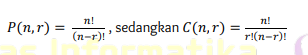
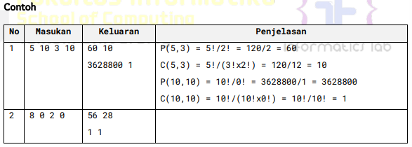
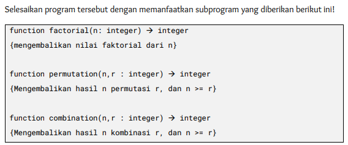
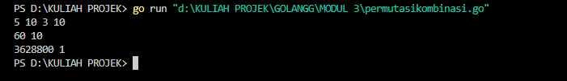
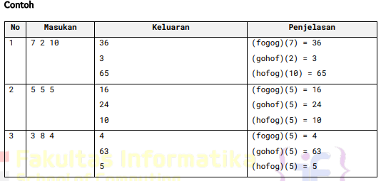
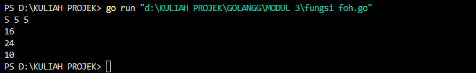
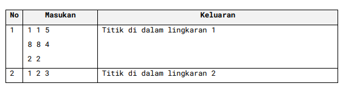
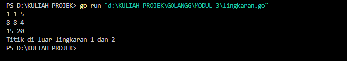

<h1 align="center">Laporan Praktikum Modul3 - Fungsi</h1>

___
<center>Nama : Rifa Cahya Ariby <center>
<center>NIM : 103112400268 <center>

# Dasar Teori

> [!NOTE]
> Fungsi adalah sekumpulan instruksi yang menghasilkan suatu nilai dengan memetakkan input ke output tertentu. Agar suatu subprogram disebut sebagai fungsi, harus memenuhi dua syarat utama:
> 1. Mendeklarasikan tipe data yang akan dikembalikan.
> 2. Memiliki pernyataan `return` dalam badan fungsi untuk mengembalikan nilai.
> Fungsi digunakan ketika suatu nilai diperlukan dalam berbagai situasi, seperti:
> - Menetapkan nilai ke dalam suatu variabel (assignment).
> - Menjadi bagian dari ekspresi dalam operasi atau perhitungan.
> - Digunakan sebagai argumen dalam pemanggilan subprogram lainnya.
> Oleh karena itu, penting untuk memilih nama fungsi yang jelas dan mencerminkan hasil yang dikembalikan. Nama fungsi sebaiknya berupa kata benda atau kata sifat yang menggambarkan tujuan fungsi tersebut, seperti _median_, _rerata_, _nilaiMaksimum_, _ditemukan_, atau _selesai_. Dengan demikian, fungsi dapat meningkatkan keterbacaan dan modularitas dalam pemrograman.

## Soal 1
Minggu ini, mahasiswa Fakultas Informatika mendapatkan tugas dari mata kuliah matematika diskrit untuk mempelajari kombinasi dan permutasi. Jonas salah seorang mahasiswa, iseng untuk mengimplementasikannya ke dalam suatu program. Oleh karena itu bersediakah kalian membantu Jonas?
Masukan terdiri dari empat buah bilangan asli a,b,c,d yang dipisahkan oleh spasi, dengan syarat a ≥ c dan b ≥ d.
Keluaran terdiri dari dua baris. Baris pertama adalah hasil permutasi dan kombinasi a terhadap c, sedangkan baris kedua adalah hasil permutasi dan kombinasi b terhadap d.
Catatan: permutasi (P) dan kombinasi (C) dari n terhadap r (n ≥ r) dapat dihitung dengan menggunakan persamaan berikut!






``` go
package main

  

import "fmt"

// Fungsi untuk menghitung faktorial

func faktorial(n int) int {

    if n == 0 || n == 1 {

        return 1

    }

    return n * faktorial(n-1)

}

  

// Fungsi untuk menghitung permutasi P(n, r) = n! / (n-r)!

func permutasi(n, r int) int {

    return faktorial(n) / faktorial(n-r)

}

  

// Fungsi untuk menghitung kombinasi C(n, r) = n! / (r! * (n-r)!)

func kombinasi(n, r int) int {

    return faktorial(n) / (faktorial(r) * faktorial(n-r))

}

  

func main() {

    var a, b, c, d int

    var c1, c2, p1, p2 int

    fmt.Scan(&a, &b, &c, &d)

  

    // Menghitung permutasi dan kombinasi untuk a terhadap c

    p1 = permutasi(a, c)

    c1 = kombinasi(a, c)

    // Menghitung permutasi dan kombinasi untuk b terhadap d

    p2 = permutasi(b, d)

    c2 = kombinasi(b, d)

    fmt.Println(p1, c1)

    fmt.Println(p2, c2)

}

```
## Output


> Kode ini adalah program Go yang menghitung permutasi dan kombinasi dari dua pasangan angka yang diberikan sebagai input. Berikut adalah kesimpulan singkatnya:
> 
> - Program ini mendefinisikan fungsi untuk menghitung faktorial, permutasi (P(n, r)), dan kombinasi (C(n, r)).
>     
> - Program menerima empat input integer (a, b, c, d) dari pengguna.
>     
> - Program menghitung permutasi dan kombinasi dari 'a diambil c' (P(a, c) dan C(a, c)) dan 'b diambil d' (P(b, d) dan C(b, d)).
>     
> - Akhirnya, program mencetak hasil permutasi dan kombinasi untuk kedua pasangan input.

## Soal 2
Diberikan tiga buah fungsi matematika yaitu f(x) = x ^ 2 g(x) = x - 2 danh e(x) = x + 1
Fungsi komposisi (fogoh)(x) artinya adalah f(g(h(x))) Tuliskan f(x) g(x) dan h(x) dalam bentuk function.
Masukan terdiri dari sebuah bilangan bulat a, b dan c yang dipisahkan oleh spasi.
Keluaran terdiri dari tiga baris. Baris pertama adalah (fogoh) (a) , baris kedua (gohof) (b) , dan baris ketiga adalah (hofog) (c)!



``` go
package main

  

import "fmt"

  

func f(x int) int {

    return x * x

}

  

func g(x int) int {

    return x - 2

}

  

func h(x int) int {

    return x + 1

}

  

// Fungsi utama

func main() {

    var a, b, c int

    fmt.Scan(&a, &b, &c)

  

    // Menghitung komposisi fungsi

    fogoh := f(g(h(a)))

    gohof := g(h(f(b)))  

    hofog := h(f(g(c)))  

  

    // Menampilkan hasil

    fmt.Println(fogoh)

    fmt.Println(gohof)

    fmt.Println(hofog)

}
```

## Output


> Program Go ini menghitung komposisi dari tiga fungsi matematis dan menampilkan hasilnya. Berikut adalah kesimpulan singkatnya:
> 
> - Terdapat tiga fungsi yang didefinisikan:
>     
>     - `f(x)`: Menghitung kuadrat dari x (x²).
>         
>     - `g(x)`: Mengurangi x dengan 2 (x - 2).
>         
>     - `h(x)`: Menambahkan 1 pada x (x + 1).
>         
> - Program menerima tiga input integer (a, b, c) dari pengguna.
>     
> - Program menghitung tiga komposisi fungsi:
>     
>     - `fogoh`: Menghitung f(g(h(a))) — yaitu hasil dari fungsi `h` diteruskan ke `g`, lalu hasilnya diteruskan ke `f`.
>         
>     - `gohof`: Menghitung g(h(f(b))) — yaitu hasil dari fungsi `f` diteruskan ke `h`, lalu hasilnya diteruskan ke `g`.
>         
>     - `hofog`: Menghitung h(f(g(c))) — yaitu hasil dari fungsi `g` diteruskan ke `f`, lalu hasilnya diteruskan ke `h`.
>         
> - Hasil dari ketiga komposisi fungsi tersebut dicetak

    

## Soal 3

[Lingkaran] Suatu lingkaran didefinisikan dengan koordinat titik pusat (cx,cy) dengan radius r. Apabila diberikan dua buah lingkaran, maka tentukan posisi sebuah titik sembarang (x,y) berdasarkan dua lingkaran tersebut. 
Masukan terdiri dari beberapa tiga baris. Baris pertama dan kedua adalah koordinat titik pusat dan radius dari lingkaran 1 dan lingkaran 2, sedangkan baris ketiga adalah koordinat titik sembarang. Asumsi sumbu x dan y dari semua titik dan juga radius direpresentasikan dengan bilangan bulat. 
Keluaran berupa string yang menyatakan posisi titik "Titik di dalam lingkaran 1 dan 2", "Titik di dalam lingkaran 1", "Titik di dalam lingkaran 2", atau "Titik di luar lingkaran 1 dan 2".




Catatan: lihat paket math dalam lampiran untuk menggunakan fungsi math.sqrt() untuk menghitung akar kuadrat.


``` go
package main

  

import (

    "fmt"

    "math"

)

  

// Fungsi untuk mengecek apakah titik (x, y) berada dalam lingkaran dengan pusat (cx, cy) dan radius r

func dalamlingkaran(x, y, cx, cy, r int) bool {

    jarak := math.Sqrt(float64((x-cx)*(x-cx) + (y-cy)*(y-cy)))

    return jarak <= float64(r)

}

  

func main() {

    var cx1, cy1, r1 int

    var cx2, cy2, r2 int

    var x, y int

    fmt.Scan(&cx1, &cy1, &r1)

    fmt.Scan(&cx2, &cy2, &r2)

    fmt.Scan(&x, &y)

  

    // Mengecek posisi titik

    dalam1 := dalamlingkaran(x, y, cx1, cy1, r1)

    dalam2 := dalamlingkaran(x, y, cx2, cy2, r2)

  

    // Menentukan keluaran berdasarkan posisi titik

    if dalam1 && dalam2 {

        fmt.Println("Titik di dalam lingkaran 1 dan 2")

    } else if dalam1 {

        fmt.Println("Titik di dalam lingkaran 1")

    } else if dalam2 {

        fmt.Println("Titik di dalam lingkaran 2")

    } else {

        fmt.Println("Titik di luar lingkaran 1 dan 2")

    }

}
```

> Program Go ini menentukan posisi suatu titik terhadap dua lingkaran. Berikut adalah kesimpulan singkatnya:
> 
> - Program mendefinisikan fungsi `dalamlingkaran` untuk menentukan apakah suatu titik (x, y) berada di dalam lingkaran dengan pusat (cx, cy) dan radius r.
>     
> - Program menerima input berupa:
>     
>     - Pusat (cx1, cy1) dan radius (r1) dari lingkaran pertama.
>         
>     - Pusat (cx2, cy2) dan radius (r2) dari lingkaran kedua.
>         
>     - Koordinat titik (x, y) yang akan diperiksa posisinya.
>         
> - Program kemudian menentukan apakah titik tersebut berada di dalam lingkaran pertama, lingkaran kedua, keduanya, atau di luar kedua lingkaran tersebut.
>     
> - Terakhir, program mencetak pesan yang sesuai dengan posisi titik terhadap kedua lingkaran.

## Output



