<h1 align="center">Laporan Praktikum Modul5 - Rekursif </h1>

<center>Nama : Rifa Cahya Ariby <center>
<center>NIM : 103112400268 <center>


# Dasar Teori
Rekursif adalah teknik dalam pemrograman yang memungkinkan suatu subprogram baik fungsi maupun prosedur untuk memanggil dirinya sendiri dalam menyelesaikan suatu masalah. Teknik ini dapat digunakan sebagai alternatif dari struktur kontrol perulangan (loop) untuk menyelesaikan berbagai permasalahan komputasi.

## Soal 1

1) Deret fibonacci adalah sebuah deret dengan nilai suku ke-0 dan ke-1 adalah 0 dan 1, dan nilai suku ke-n selanjutnya adalah hasil penjumlahan dua suku sebelumnya. Secara umum dapat diformulasikan 𝑆𝑛 = 𝑆𝑛−1 + 𝑆𝑛−2 . Berikut ini adalah contoh nilai deret fibonacci hingga suku ke-10. 
Buatlah program yang mengimplementasikan fungsi rekursif pada deret fibonacci tersebut.

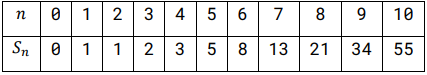

``` go
package main

import "fmt" 
func fibonacci(n int) int {

    if n == 0 {

        return 0

    } else if n == 1 {

        return 1

    } else {

        return fibonacci(n-1) + fibonacci(n-2)

    }

}

func main() {

    var bil int

    fmt.Scan(&bil)

  

    for i := 0; i < bil; i++ {

        fmt.Print(fibonacci(i), " ")

    }

    fmt.Println()

}

```
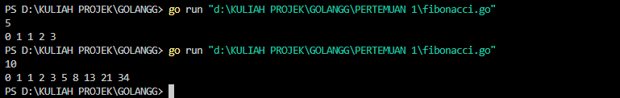
Program di atas adalah implementasi fungsi Fibonacci dalam bahasa Go. Fungsi fibonacci(n int) menghitung bilangan Fibonacci ke-n secara rekursif, di mana bilangan Fibonacci didefinisikan dengan dua nilai awal (0 dan 1) dan setiap bilangan berikutnya adalah jumlah dari dua bilangan sebelumnya. Dalam fungsi `main`, program meminta input dari pengguna untuk menentukan berapa banyak bilangan Fibonacci yang akan dicetak, kemudian menggunakan loop `for` untuk mencetak deretan bilangan Fibonacci dari 0 hingga n-1.

## Soal 2

2) Buatlah sebuah program yang digunakan untuk menampilkan pola bintang berikut ini dengan menggunakan fungsi rekursif. N adalah masukan dari user.
 
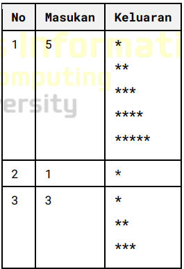

``` go
package main

import "fmt"

func cetakBintang(jumlah int) {

    if jumlah == 0 {

        fmt.Println()

    } else {

        fmt.Print("*")

        cetakBintang(jumlah - 1)

    }

}

func Pola(tinggi, baris int) {

    if baris > tinggi {

        return

    } else {

        cetakBintang(baris)      

        Pola(tinggi, baris+1)

    }

}

func main() {

    var tinggi int

    fmt.Scan(&tinggi)

    Pola(tinggi, 1)

}
```
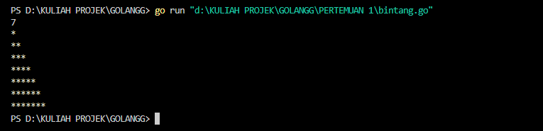

Program di atas membuat pola bintang segitiga menggunakan rekursi dalam bahasa Go. Fungsi `cetakBintang(jumlah int)` mencetak sejumlah bintang (`*`) pada satu baris, sesuai dengan nilai yang diberikan. Jika `jumlah` mencapai 0, baris kosong akan dicetak. Fungsi `Pola(tinggi, baris int)` digunakan untuk mengontrol berapa banyak baris yang akan dicetak; selama `baris` kurang dari atau sama dengan `tinggi`, fungsi ini akan memanggil `cetakBintang` untuk mencetak bintang pada setiap baris yang sesuai, kemudian memanggil dirinya sendiri untuk baris berikutnya. Di dalam fungsi `main`, program meminta input dari pengguna untuk menentukan tinggi segitiga, dan kemudian memanggil fungsi `Pola` untuk mencetak pola tersebut.

## Soal 3

3) Buatlah program yang mengimplementasikan rekursif untuk menampilkan faktor bilangan dari suatu N, atau bilangan yang apa saja yang habis membagi N. Masukan terdiri dari sebuah bilangan bulat positif N. Keluaran terdiri dari barisan bilangan yang menjadi faktor dari N 
``` go
package main

import "fmt"

func faktor(n, i int) {

    if i > n {

        return

    }

    if n%i == 0 {

        fmt.Print(i, " ")

    }

    faktor(n, i+1)

}

  

func main() {

    var n int

    fmt.Scan(&n)

    faktor(n, 1)

}
```
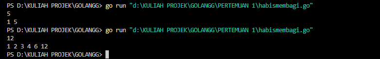

Program di atas berfungsi untuk mencetak faktor-faktor dari sebuah bilangan bulat positif menggunakan rekursi dalam bahasa Go. Fungsi `faktor(n, i int)` mengambil dua parameter: `n`, yang merupakan bilangan yang ingin dicari faktornya, dan `i`, yang memulai dari 1 dan digunakan untuk mengecek apakah `i` adalah faktor dari `n`. Jika `i` lebih besar dari `n`, fungsi akan berhenti. Jika `n` dapat dibagi habis oleh `i` (yaitu sisa bagi `n` dengan `i` adalah 0), maka `i` dicetak sebagai faktor. Fungsi tersebut kemudian memanggil dirinya sendiri dengan parameter `i` ditambah satu untuk melanjutkan pencarian faktor berikutnya. Di dalam fungsi `main`, program meminta input dari pengguna untuk bilangan `n` dan kemudian memanggil fungsi `faktor` untuk mencetak semua faktornya.

## Soal 4

4) Buatlah program yang mengimplementasikan rekursif untuk menampilkan barisan bilangan tertentu. Masukan terdiri dari sebuah bilangan bulat positif N. Keluaran terdiri dari barisan bilangan dari N hingga 1 dan kembali ke N. 
Contoh masukan dan keluaran:

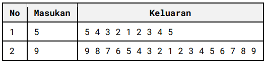

``` go
package main

  

import "fmt"

  

func turun(n int) {

    if n == 0 {

        return

    }

    fmt.Print(n, " ")

    turun(n - 1)

}

  

func naik(i, n int) {

    if i > n {

        return

    }

    fmt.Print(i, " ")

    naik(i+1, n)

}

  

func main() {

    var n int

    fmt.Scan(&n)

  

    turun(n)  

    naik(2, n)

}
```

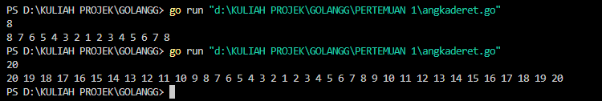

Program di atas adalah implementasi dalam bahasa Go yang mencetak angka secara berurutan turun dari `n` hingga 1, dan kemudian mencetak angka secara berurutan naik dari 2 hingga `n`. Fungsi `turun(n int)` menggunakan rekursi untuk mencetak angka dimulai dari `n`, dan setiap kali memanggil dirinya sendiri dengan `n` dikurangi 1, hingga mencapai 0, di mana fungsi akan berhenti. Fungsi `naik(i, n int)` juga menggunakan rekursi untuk mencetak angka dimulai dari 2 hingga `n`, dan terus memanggil dirinya sendiri dengan `i` ditambahkan 1, hingga `i` lebih besar dari `n`, di mana fungsi akan berhenti. Dalam fungsi `main`, program meminta pengguna memasukkan nilai `n`, lalu memanggil kedua fungsi untuk menghasilkan urutan angka yang diinginkan.

## Soal 5

5) Buatlah program yang mengimplementasikan rekursif untuk menampilkan barisan bilangan ganjil. Masukan terdiri dari sebuah bilangan bulat positif N. Keluaran terdiri dari barisan bilangan ganjil dari 1 hingga N. 
Contoh masukan dan keluaran:

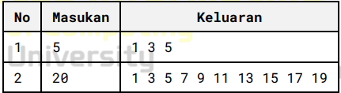

``` go
package main

import "fmt"

func cetakGanjil(i, n int) {

    if i > n {

        return

    }

    if i%2 != 0 {

        fmt.Print(i, " ")

    }

    cetakGanjil(i+1, n)

}

  

func main() {

    var bil int

    fmt.Scan(&bil)

    cetakGanjil(1, bil)

}
```
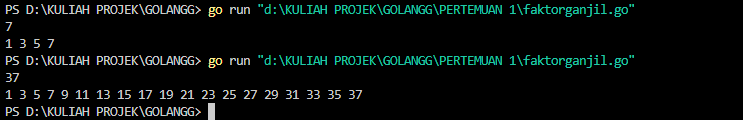

Program di atas adalah program dalam bahasa Go yang mencetak semua bilangan ganjil dari 1 hingga `bil`, di mana `bil` adalah input dari pengguna. Fungsi `cetakGanjil(i, n int)` menggunakan rekursi untuk mengecek setiap angka `i` mulai dari 1 hingga `n`. Jika `i` lebih besar dari `n`, fungsi akan berhenti. Di dalam fungsi, jika `i` adalah bilangan ganjil (diperiksa dengan `i%2 != 0`), maka angka tersebut dicetak. Fungsi kemudian memanggil dirinya sendiri dengan `i` ditambahkan 1 untuk memproses angka berikutnya. Dalam fungsi `main`, program meminta input dari pengguna, dan memanggil fungsi `cetakGanjil` untuk mulai mencetak bilangan ganjil.

## Soal 6

6) Buatlah program yang mengimplementasikan rekursif untuk mencari hasil pangkat dari dua buah bilangan. Masukan terdiri dari bilangan bulat x dan y. Keluaran terdiri dari hasil x dipangkatkan y. Catatan: diperbolehkan menggunakan asterik "*", tapi dilarang menggunakan import "math".
Contoh masukan dan keluaran:

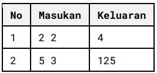

``` go
package main

import "fmt"

func pangkat(x, y int) int {

    if y == 0 {

        return 1

    } else {

        return x * pangkat(x, y-1)

    }

}

func main() {

    var x, y int

    fmt.Scan(&x)

    fmt.Scan(&y)


    fmt.Println(pangkat(x, y))

}
```
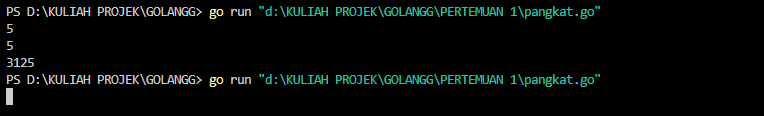

Program di atas ditulis dalam bahasa Go dan berfungsi untuk menghitung nilai `x` pangkat `y` (x^y) menggunakan rekursi. Fungsi `pangkat(x, y int) int` menerima dua parameter: `x`, basis dari pangkat, dan `y`, eksponen. Jika `y` sama dengan 0, fungsi mengembalikan 1 (karena setiap bilangan pangkat 0 adalah 1). Jika tidak, fungsi mengembalikan hasil perkalian antara `x` dan hasil pemanggilan fungsi `pangkat` dengan `y` dikurangi 1, sehingga secara bertahap menghitung `x^y`. Di dalam fungsi `main`, program meminta pengguna untuk memasukkan nilai `x` dan `y`, lalu memanggil fungsi `pangkat` dan mencetak hasilnya.
