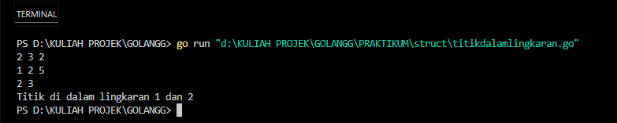
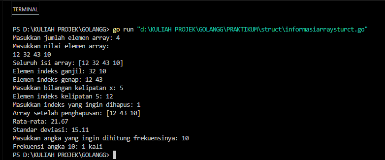
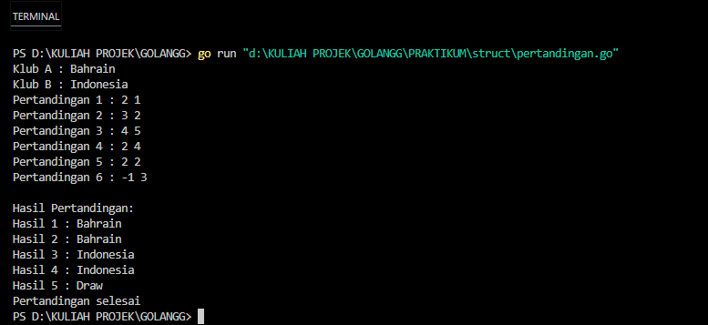
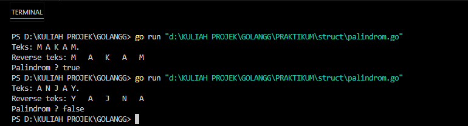

<h1 align="center">Laporan Praktikum Modul 7 - Struct & Array</h1>


<center>Nama : Rifa Cahya Ariby <center>
<center>NIM : 103112400268 <center>

# Dasar Teori
## A. Struct 

Struct adalah tipe data yang digunakan untuk mengelompokkan beberapa variabel dengan tipe data yang berbeda dalam satu entitas. Struct sangat berguna untuk membuat objek dengan berbagai atribut.
#### Karakteristik Struct
- Berisi beberapa variabel dengan tipe data yang berbeda.
- Digunakan untuk membentuk struktur data yang kompleks.
- Mirip dengan class dalam pemrograman berorientasi objek, tetapi tidak mendukung pewarisan.

## B. Array
Array adalah struktur data yang digunakan untuk menyimpan sekumpulan elemen dengan tipe data yang sama dalam satu variabel. Elemen-elemen dalam array disusun dalam urutan dan dapat diakses menggunakan indeks.
#### Karakteristik Array
- Memiliki ukuran tetap yang harus ditentukan saat deklarasi.
- Menyimpan elemen dengan tipe data yang sama.
- Elemen dalam array dapat diakses menggunakan indeks, yang dimulai dari 0.
- Array dapat memiliki satu dimensi (array satu dimensi) atau lebih (array multidimensi).

### Latihan Soal Modul 7
### Soal 1

Suatu lingkaran didefinisikan dengan koordinat titik pusat (𝑐𝑥, 𝑐𝑦) dengan radius 𝑟. Apabila diberikan dua buah lingkaran, maka tentukan posisi sebuah titik sembarang (𝑥, 𝑦) berdasarkan dua lingkaran tersebut. Gunakan tipe bentukan titik untuk menyimpan koordinat, dan tipe bentukan lingkaran untuk menyimpan titik pusat lingkaran dan radiusnya.

**Masukan** terdiri dari beberapa tiga baris. Baris pertama dan kedua adalah koordinat titik pusat dan radius dari lingkaran 1 dan lingkaran 2, sedangkan baris ketiga adalah koordinat titik sembarang. Asumsi sumbu x dan y dari semua titik dan juga radius direpresentasikan dengan bilangan bulat. 


**Keluaran** berupa string yang menyatakan posisi titik "Titik di dalam lingkaran 1 dan 2", "Titik di dalam lingkaran 1", "Titik di dalam lingkaran 2", atau "Titik di luar lingkaran 1 dan 2".

| No | Masukan             | Keluaran                                                                               |
|----|-------------------------------|------------------------------|
| 1  | 1 1 1 5 <br> 8 8 4 <br> 2 2  | Titik di dalam lingkaran 1 |
| 2  | 2 1 2 3 <br> 4 5 6 <br> 7 8  | Titik di dalam lingkaran 2 |
| 3  | 3 5 10 15 <br> -15 4 20 <br> 0 0 | Titik di dalam lingkaran 1 dan 2 |
| 4  | 4 1 1 5 <br> 8 8 4 <br> 15 20 | Titik di luar lingkaran 1 dan 2 |

Fungsi untuk menghitung jarak titik (a, b) dan (c, d) dimana rumus jarak adalah:

$$
jarak = \sqrt{(a - c)^2 + (b - d)^2}
$$

dan juga fungsi untuk menentukan posisi sebuah titik sembarang berada di dalam suatu lingkaran atau tidak.
``` 
function jarak(p, q : titik) -> real {Mengembalikan jarak antara titik p(x,y) dan titik q(x,y)}
function didalam(c:lingkaran, p:titik) -> boolean {Mengembalikan true apabila titik p(x,y) berada di dalam lingkaran c yang memiliki titik pusat (cx,cy) dan radius r}
```
Catatan: Lihat paket math dalam lampiran untuk menggunakan fungsi math.Sqrt() untuk menghitung akar kuadrat.

### Code Program GO
``` go
package main
import (
    "fmt"
    "math"
)
type Titik struct {
    x int
    y int
}
type Lingkaran struct {
    pusat Titik
    radius int
}
func jarak(p Titik, q Titik) float64 {
    return math.Sqrt(float64((p.x-q.x)*(p.x-q.x) + (p.y-q.y)*(p.y-q.y)))
}
func didalam(c Lingkaran, p Titik) bool {
    return jarak(c.pusat, p) < float64(c.radius)
}
func main() {
    var lingkaran1, lingkaran2 Lingkaran
    var titikSembarang Titik
    
    fmt.Scan(&lingkaran1.pusat.x, &lingkaran1.pusat.y, &lingkaran1.radius)
    fmt.Scan(&lingkaran2.pusat.x, &lingkaran2.pusat.y, &lingkaran2.radius)
    fmt.Scan(&titikSembarang.x, &titikSembarang.y)

    inLingkaran1 := didalam(lingkaran1, titikSembarang)
    inLingkaran2 := didalam(lingkaran2, titikSembarang)

    if inLingkaran1 && inLingkaran2 {
        fmt.Println("Titik di dalam lingkaran 1 dan 2")
    } else if inLingkaran1 {
        fmt.Println("Titik di dalam lingkaran 1")
    } else if inLingkaran2 {
        fmt.Println("Titik di dalam lingkaran 2")
    } else {
        fmt.Println("Titik di luar lingkaran 1 dan 2")
    }
}
```
#### Output



> Program di atas bertujuan untuk menentukan posisi suatu titik terhadap dua lingkaran. Program menerima input berupa koordinat pusat dan radius dari dua lingkaran, serta koordinat titik sembarang. Kemudian, jarak antara titik dan pusat lingkaran dihitung menggunakan rumus Euclidean. Berdasarkan hasil perhitungan tersebut, program memeriksa apakah titik berada di dalam salah satu lingkaran, kedua lingkaran, atau di luar keduanya. Hasil akhirnya ditampilkan dalam bentuk teks yang menjelaskan posisi titik terhadap lingkaran-lingkaran tersebut. Program ini menggunakan struktur data `struct` untuk merepresentasikan titik dan lingkaran, serta memanfaatkan fungsi untuk menghitung jarak dan menentukan posisi titik relatif terhadap lingkaran.


### Soal 2

Sebuah array digunakan untuk menampung sekumpulan bilangan bulat. Buatlah program yang digunakan untuk mengisi array tersebut sebanyak N elemen nilai. Asumsikan array memiliki kapasitas penyimpanan data sejumlah elemen tertentu. 
Program dapat menampilkan beberapa informasi berikut: 
a. Menampilkan keseluruhan isi dari array. 
b. Menampilkan elemen-elemen array dengan indeks ganjil saja. 
c. Menampilkan elemen-elemen array dengan indeks genap saja (asumsi indek ke-0 adalah genap). 
d. Menampilkan elemen-elemen array dengan indeks kelipatan bilangan x. x bisa diperoleh dari masukan pengguna. 
e. Menghapus elemen array pada indeks tertentu, asumsi indeks yang hapus selalu valid. Tampilkan keseluruhan isi dari arraynya, pastikan data yang dihapus tidak tampil 
f. Menampilkan rata-rata dari bilangan yang ada di dalam array. 
g. Menampilkan standar deviasi atau simpangan baku dari bilangan yang ada di dalam array tersebut. 
h. Menampilkan frekuensi dari suatu bilangan tertentu di dalam array yang telah diisi tersebut.

#### Code Program GO
``` go
package main
import (
    "fmt"
    "math"
)
// Fungsi untuk menghitung rata-rata
func rataRata(arr []int) float64 {
    total := 0
    for _, v := range arr {
        total += v
    }
    return float64(total) / float64(len(arr))
}

// Fungsi untuk menghitung standar deviasi

func standarDeviasi(arr []int) float64 {
    mean := rataRata(arr)
    var sum float64
    for _, v := range arr {
        sum += math.Pow(float64(v)-mean, 2)
    }
    return math.Sqrt(sum / float64(len(arr)))
}
// Fungsi untuk menampilkan array berdasarkan kondisi indeks
func tampilkanArray(arr []int, kondisi func(int) bool) {
    for i, v := range arr {
        if kondisi(i) {
            fmt.Print(v, " ")
        }
    }
    fmt.Println()
}
// Fungsi untuk menghapus elemen pada indeks tertentu
func hapusElemen(arr []int, index int) []int {
    return append(arr[:index], arr[index+1:]...)
}
// Fungsi untuk menghitung frekuensi bilangan dalam array
func hitungFrekuensi(arr []int, angka int) int {
    count := 0
    for _, v := range arr {
        if v == angka {
            count++
        }
    }
    return count
}
func main() {
    var N, x, indexHapus, cariAngka int
  
    // Input jumlah elemen array
    fmt.Print("Masukkan jumlah elemen array: ")
    fmt.Scan(&N)
    arr := make([]int, N)
    // Input nilai array
    fmt.Println("Masukkan nilai elemen array:")

    for i := 0; i < N; i++ {
        fmt.Scan(&arr[i])
    }
    
    // a. Menampilkan seluruh isi array
    fmt.Println("Seluruh isi array:", arr)

    // b. Menampilkan elemen dengan indeks ganjil
    fmt.Print("Elemen indeks ganjil: ")

    tampilkanArray(arr, func(i int) bool { return i%2 == 1 })
    
    // c. Menampilkan elemen dengan indeks genap
    fmt.Print("Elemen indeks genap: ")

    tampilkanArray(arr, func(i int) bool { return i%2 == 0 })

    // d. Menampilkan elemen dengan indeks kelipatan x
    fmt.Print("Masukkan bilangan kelipatan x: ")
    fmt.Scan(&x)
    fmt.Print("Elemen indeks kelipatan ", x, ": ")
    tampilkanArray(arr, func(i int) bool { return i%x == 0 })

    // e. Menghapus elemen array pada indeks tertentu
    fmt.Print("Masukkan indeks yang ingin dihapus: ")
    fmt.Scan(&indexHapus)
    arr = hapusElemen(arr, indexHapus)
    fmt.Println("Array setelah penghapusan:", arr)
    
    // f. Menampilkan rata-rata
    fmt.Printf("Rata-rata: %.2f\n", rataRata(arr))

    // g. Menampilkan standar deviasi
    fmt.Printf("Standar deviasi: %.2f\n", standarDeviasi(arr))

    // h. Menampilkan frekuensi bilangan tertentu
    fmt.Print("Masukkan angka yang ingin dihitung frekuensinya: ")
    fmt.Scan(&cariAngka)
    fmt.Printf("Frekuensi angka %d: %d kali\n", cariAngka, hitungFrekuensi(arr, cariAngka))
}
```

#### Output



> Secara keseluruhan, program ini memberikan alat untuk melakukan analisis dasar pada kumpulan data numerik dalam bentuk array, memungkinkan pengguna untuk melakukan berbagai operasi statistik dan manipulasi data.

### Soal 3

Sebuah program digunakan untuk menyimpan dan menampilkan nama-nama klub yang memenangkan pertandingan bola pada suatu grup pertandingan. Buatlah program yang digunakan untuk merekap skor pertandingan bola 2 buah klub bola yang berlaga. Pertama-tama program meminta masukan nama-nama klub yang bertanding, kemudian program meminta masukan skor hasil pertandingan kedua klub tersebut. Yang disimpan dalam array adalah nama-nama klub yang menang saja. Proses input skor berhenti ketika skor salah satu atau kedua klub tidak valid (negatif). Di akhir program, tampilkan daftar klub yang memenangkan pertandingan.

Perhatikan sesi interaksi pada contoh berikut ini
(teks bergaris bawah adalah input/read) 
```
Klub A : MU 
Klub B : Inter 
Pertandingan 1 : 2 0         // MU = 2 sedangkan Inter = 0 
Pertandingan 2 : 1 2 
Pertandingan 3 : 2 2 
Pertandingan 4 : 0 1 
Pertandingan 5 : 3 2 
Pertandingan 6 : 1 0 
Pertandingan 7 : 5 2 
Pertandingan 8 : 2 3 
Pertandingan 9 : -1 2 
Hasil 1 : MU 
Hasil 2 : Inter 
Hasil 3 : Draw 
Hasil 4 : Inter 
Hasil 5 : MU 
Hasil 6 : MU 
Hasil 7 : MU 
Hasil 8 : Inter 
Pertandingan selesai
```


#### Code Program GO
``` go
package main
import "fmt"
func main() {
    var klubA, klubB string
    var skorA, skorB int
    var pemenang []string
    var pertandingan int = 1

    fmt.Print("Klub A : ")
    fmt.Scan(&klubA)
    fmt.Print("Klub B : ")
    fmt.Scan(&klubB)

    for {
        fmt.Printf("Pertandingan %d : ", pertandingan)
        fmt.Scan(&skorA, &skorB)

        if skorA < 0 || skorB < 0 {
            break
        }
        if skorA > skorB {
            pemenang = append(pemenang, klubA)
        } else if skorA < skorB {
            pemenang = append(pemenang, klubB)
        } else {
            pemenang = append(pemenang, "Draw")
        }
        pertandingan++
    } 
    fmt.Println("\nHasil Pertandingan:")
    
    for i, hasil := range pemenang {
        fmt.Printf("Hasil %d : %s\n", i+1, hasil)
    }
    fmt.Println("Pertandingan selesai")
}
```

#### Output



> Program ini dirancang untuk mencatat hasil pertandingan sepak bola antara dua klub. Pengguna diminta untuk memasukkan nama klub A dan klub B, kemudian program akan meminta skor dari setiap pertandingan yang berlangsung. Proses ini berlanjut hingga pengguna memasukkan skor negatif, yang menandakan bahwa tidak ada pertandingan lagi yang akan dicatat.
 

### Soal 4

Sebuah array digunakan untuk menampung sekumpulan karakter, Anda diminta untuk membuat sebuah subprogram untuk melakukan membalikkan urutan isi array dan memeriksa apakah membentuk palindrom.

``` go
package main 
import "fmt"
const NMAX int = 127
type tabel [NMAX] rune 
	tab : tabel 
	m : integer 
func isiArray(t *tabel, n *int) 
	/*I.S. Data tersedia dalam piranti masukan F.S. Array t berisi sejumlah n karakter yang dimasukkan user, Proses input selama karakter bukanlah TITIK dan n <= NMAX */
func cetakArray(t tabel, n int) 
	/*I.S. Terdefinisi array t yang berisi sejumlah n karakter 
		F.S. n karakter dalam array muncul di layar */ 
func balikanArray(t *tabel, n int) 
	/*I.S. Terdefinisi array t yang berisi sejumlah n karakter
		F.S. Urutan isi array t terbalik */ 
func main(){ 
	var tab tabel 
	var m int
	// si array tab dengan memanggil prosedur isiArray 
	// Balikian isi array tab dengan memanggil balikanArray
	// Cetak is array tab
 }
```
Perhatikan sesi interaksi pada contoh berikut ini (teks bergaris bawah adalah input/read)
```
Teks : S E N A N G . 
Reverse teks : G N A N E S T
eks : K A T A K .
Reverse teks : K A T A K
```

Modifikasi program tersebut dengan menambahkan fungsi palindrom. Tambahkan instruksi untuk memanggil fungsi tersebut dan menampilkan hasilnya pada program utama. 
*Palindrom adalah teks yang dibaca dari awal atau akhir adalah sama, contoh: KATAK, APA, KASUR_RUSAK.

```
func palindrom(t tabel, n int) bool 
/* Mengembalikan true apabila susunan karakter di dalam t membentuk palindrom, dan false apabila sebaliknya. 
Petunjuk: Manfaatkan prosedur balikanArray */
```

Perhatikan sesi interaksi pada contoh berikut ini (teks bergaris bawah adalah input/read) 
```
Teks : K A T A K 
Palindrom ? true 
Teks : S E N A N G 
Palindrom ? false
```

#### Code Program GO

```go
package main
import "fmt"
const NMAX int = 127
type tabel [NMAX]rune

// MeNgisi array hingga ditemukan karakter titik (.)
func isiArray(t *tabel, n *int) {
    var ch rune
    *n = 0
    
    for {
        fmt.Scanf("%c", &ch)
        if ch == '.' || *n >= NMAX {
            break
        }
        t[*n] = ch
        *n++
    }
}
  
// Mencetak isi array
func cetakArray(t tabel, n int) {
    for i := 0; i < n; i++ {
        fmt.Printf("%c ", t[i])
    }
    fmt.Println()
}
  
// Membalikkan isi array
func balikanArray(t *tabel, n int) {
    for i := 0; i < n/2; i++ {
        t[i], t[n-1-i] = t[n-1-i], t[i]
    }
}

// Mengecek apakah array membentuk palindrom
func palindrom(t tabel, n int) bool {
    for i := 0; i < n/2; i++ {
        if t[i] != t[n-1-i] {
            return false
        }
    }
    return true
}

func main() {
    var tab tabel
    var m int

    fmt.Print("Teks: ")
    isiArray(&tab, &m)

    fmt.Print("Reverse teks: ")
    balikanArray(&tab, m)
    cetakArray(tab, m)
    
    fmt.Println("Palindrom ?", palindrom(tab, m))
}
```

#### Output



> Program di atas memungkinkan pengguna untuk memasukkan sekumpulan karakter ke dalam array hingga menemukan tanda titik (.), kemudian mencetak teks dalam urutan normal maupun terbalik, serta memeriksa apakah teks tersebut merupakan palindrom. Dengan pendekatan modular menggunakan fungsi-fungsi terpisah, program ini efisien dalam memproses dan menganalisis karakter dalam array, menjadikannya berguna untuk berbagai operasi manipulasi string sederhana.
